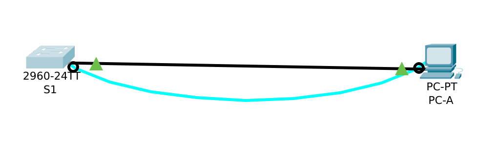
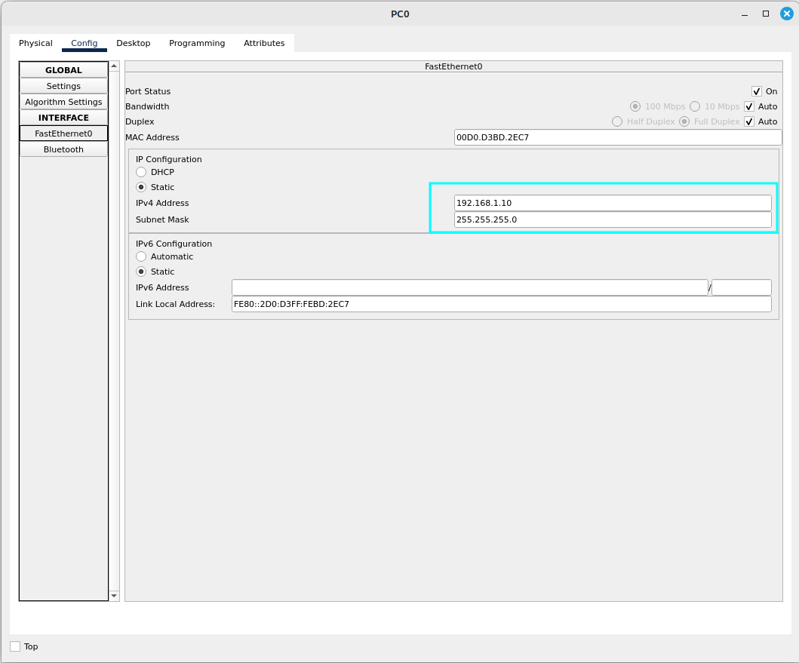

### ЗАДАННАЯ ТОПОЛОГИЯ СЕТИ ДЛЯ ЛАБОРАТОРНОЙ РАБОТЫ №1

Топология сети




# Шаг 1. Создайте сеть согласно топологии.
### Почему нужно использовать консольное подключение для первоначальной настройки коммутатора? Почему нельзя подключиться к коммутатору через Telnet или SSH?
- Физический порт управления используется для выполнения начальных конфигураций, в то время как SSH и Telnet соединения являются виртуальными интерфейсами
- Не настроен основной конфиг устройства для сопоставления конечных точек соединения (ip-адресация,имя-хоста,пароль,Баннер)

# Шаг 2. Проверьте настройки коммутатора по умолчанию.
### a. Введите команду enable, после чего убедитесь, что на коммутаторе находится пустой файл конфигурации по умолчанию введя команду show running-config
```
Switch>enable
Switch#show running-config 
```
### b. Настройки running configuration
- Количество интерфейсов FastEthernet равно 24
- Количество интерфейсов GigabitEthernet равно 2
- Диапазон значений отображаемых в VTY равен [0-15] (всего 16 возможных виртуальных соединения)
```Current configuration : 1076 bytes
!
version 15.0
no service timestamps log datetime msec
no service timestamps debug datetime msec
no service password-encryption
!
hostname S1
!
!
!
!
!
!
spanning-tree mode pvst
spanning-tree extend system-id
!
interface FastEthernet0/1
!
interface FastEthernet0/2
!
interface FastEthernet0/3
!
interface FastEthernet0/4
!
interface FastEthernet0/5
!
interface FastEthernet0/6
!
interface FastEthernet0/7
!
interface FastEthernet0/8
!
interface FastEthernet0/9
!
interface FastEthernet0/10
!
interface FastEthernet0/11
!
interface FastEthernet0/12
!
interface FastEthernet0/13
!
interface FastEthernet0/14
!
interface FastEthernet0/15
!
interface FastEthernet0/16
!
interface FastEthernet0/17
!
interface FastEthernet0/18
!
interface FastEthernet0/19
!
interface FastEthernet0/20
!
interface FastEthernet0/21
!
interface FastEthernet0/22
!
interface FastEthernet0/23
!
interface FastEthernet0/24
!
interface GigabitEthМЛernet0/1
!
interface GigabitEthernet0/2
!
interface Vlan1
 no ip address
 shutdown
!
!
!
!
line con 0
!
line vty 0 4
 login
line vty 5 15
 login
!
!
!
!
end
```
### c. Почему появляется сообщение "startup-config is not present"
- Не настроен startup config для устройства S1
- не выполнена команда:
```
copy running-config startup-config
```
### d. Изучите характеристики SVI для VLAN 1.
- Так как интерфейс отключен и настройки SVI не установлены мы не сможем увидеть ip-адрес, mac-адрес для VLAN 1

### e. Изучите IP-свойства интерфейса SVI сети VLAN 1.
- вводим команды
```
S1>enable
S1#show ip interface brief
```
-Получаем вывод
```Interface              IP-Address      OK? Method Status                Protocol 
FastEthernet0/1        unassigned      YES manual down                  down 
FastEthernet0/2        unassigned      YES manual down                  down 
FastEthernet0/3        unassigned      YES manual down                  down 
FastEthernet0/4        unassigned      YES manual down                  down 
FastEthernet0/5        unassigned      YES manual down                  down 
FastEthernet0/6        unassigned      YES manual down                  down 
FastEthernet0/7        unassigned      YES manual down                  down 
FastEthernet0/8        unassigned      YES manual down                  down 
FastEthernet0/9        unassigned      YES manual down                  down 
FastEthernet0/10       unassigned      YES manual down                  down 
FastEthernet0/11       unassigned      YES manual down                  down 
FastEthernet0/12       unassigned      YES manual down                  down 
FastEthernet0/13       unassigned      YES manual down                  down 
FastEthernet0/14       unassigned      YES manual down                  down 
FastEthernet0/15       unassigned      YES manual down                  down 
FastEthernet0/16       unassigned      YES manual down                  down 
FastEthernet0/17       unassigned      YES manual down                  down 
FastEthernet0/18       unassigned      YES manual down                  down 
FastEthernet0/19       unassigned      YES manual down                  down 
FastEthernet0/20       unassigned      YES manual down                  down 
FastEthernet0/21       unassigned      YES manual down                  down 
FastEthernet0/22       unassigned      YES manual down                  down 
FastEthernet0/23       unassigned      YES manual down                  down 
FastEthernet0/24       unassigned      YES manual down                  down 
GigabitEthernet0/1     unassigned      YES manual down                  down 
GigabitEthernet0/2     unassigned      YES manual down                  down 
Vlan1                  unassigned      YES manual administratively down down
```
### f. Изучите IP-свойства интерфейса SVI сети VLAN 1. (после подключения Ethernet кабеля)
- вводим команды
```
S1>enable
S1#show ip interface brief
```
-Получаем вывод
```
Interface              IP-Address      OK? Method Status                Protocol 
FastEthernet0/1        unassigned      YES manual down                  down 
FastEthernet0/2        unassigned      YES manual down                  down 
FastEthernet0/3        unassigned      YES manual down                  down 
FastEthernet0/4        unassigned      YES manual down                  down 
FastEthernet0/5        unassigned      YES manual down                  down 
FastEthernet0/6        unassigned      YES manual up                    up 
FastEthernet0/7        unassigned      YES manual down                  down 
FastEthernet0/8        unassigned      YES manual down                  down 
FastEthernet0/9        unassigned      YES manual down                  down 
FastEthernet0/10       unassigned      YES manual down                  down 
FastEthernet0/11       unassigned      YES manual down                  down 
FastEthernet0/12       unassigned      YES manual down                  down 
FastEthernet0/13       unassigned      YES manual down                  down 
FastEthernet0/14       unassigned      YES manual down                  down 
FastEthernet0/15       unassigned      YES manual down                  down 
FastEthernet0/16       unassigned      YES manual down                  down 
FastEthernet0/17       unassigned      YES manual down                  down 
FastEthernet0/18       unassigned      YES manual down                  down 
FastEthernet0/19       unassigned      YES manual down                  down 
FastEthernet0/20       unassigned      YES manual down                  down 
FastEthernet0/21       unassigned      YES manual down                  down 
FastEthernet0/22       unassigned      YES manual down                  down 
FastEthernet0/23       unassigned      YES manual down                  down 
FastEthernet0/24       unassigned      YES manual down                  down 
GigabitEthernet0/1     unassigned      YES manual down                  down 
GigabitEthernet0/2     unassigned      YES manual down                  down 
Vlan1                  unassigned      YES manual administratively down down
```

### g. Изучите сведения о версии ОС Cisco IOS на коммутаторе
```
Switch#show running-config 
```
- Коммутатор работает под управлением Cisco IOS 15.0
```
Switch#show dir
```
- Файл образа системы называется - 
2960-lanbasek9-mz.150-2.SE4.bin

### h. Изучите свойства по умолчанию интерфейса FastEthernet, который используется компьютером PC-A.
```
Switch# show interface f0/6 
```
- Интерфейс включен 
```
FastEthernet0/6 is up, line protocol is up (connected)
  Hardware is Lance, address is 000a.41a7.2c06 (bia 000a.41a7.2c06)
 BW 100000 Kbit, DLY 1000 usec,
     reliability 255/255, txload 1/255, rxload 1/255
  Encapsulation ARPA, loopback not set
  Keepalive set (10 sec)
  Full-duplex, 100Mb/s
  input flow-control is off, output flow-control is off
  ARP type: ARPA, ARP Timeout 04:00:00
  Last input 00:00:08, output 00:00:05, output hang never
  Last clearing of "show interface" counters never
  Input queue: 0/75/0/0 (size/max/drops/flushes); Total output drops: 0
  Queueing strategy: fifo
  Output queue :0/40 (size/max)
  5 minute input rate 0 bits/sec, 0 packets/sec
  5 minute output rate 0 bits/sec, 0 packets/sec
     956 packets input, 193351 bytes, 0 no buffer
     Received 956 broadcasts, 0 runts, 0 giants, 0 throttles
     0 input errors, 0 CRC, 0 frame, 0 overrun, 0 ignored, 0 abort
     0 watchdog, 0 multicast, 0 pause input
     0 input packets with dribble condition detected
     2357 packets output, 263570 bytes, 0 underruns
     0 output errors, 0 collisions, 10 interface resets
     0 babbles, 0 late collision, 0 deferred
     0 lost carrier, 0 no carrier
     0 output buffer failures, 0 output buffers swapped out
```
#### Что бы включить виртуальный интерфейс необходимо:
1. Соединить Ethernet кабелем коммутатор и PC
2. Активировать Прив.режим командой enable
3. Активировать режим глобальной конфигурации командой configure terminal
4. Активировать режим подконфигурации командой interface FastEthernet 0/6 
5. Настроить основные параметры интерфейса (ip-адрес,маску подсети)
3. Активировать виртуальный интерфейс командой no shutdown
#### Какой MAC-адрес у интерфейса 0/6
1. address is 000a.41a7.2c06 (см. пункт h выше)
#### Какие настройки скорости и дуплекса заданы в интерфейсе?
1. BW 100000 Kbit: Пропускная способность интерфейса составляет 100 Мбит/с. Это максимальная скорость передачи данных, которую может обеспечить интерфейс.
2. DLY 1000 usec: Задержка составляет 1000 микросекунд (или 1 миллисекунда). Это время, необходимое для передачи данных от источника к получателю.
3. Reliability 255/255: Это значение указывает на надежность интерфейса, где 255/255 означает, что интерфейс работает без ошибок и потерь.
4. Txload 1/255 и Rxload 1/255: Эти значения показывают загрузку интерфейса. Txload (передача) и Rxload (прием) равны 1/255, что указывает на очень низкую загрузку интерфейса, практически не использующего свои ресурсы.
5. Encapsulation ARPA: Указывает на тип инкапсуляции, используемой на интерфейсе. ARPA (Address Resolution Protocol) — это стандартный метод для разрешения IP-адресов в MAC-адреса.
6. Full-duplex, 100Mb/s: Интерфейс работает в режиме full-duplex, что позволяет одновременно передавать и принимать данные на скорости 100 Мбит/с.
7. Input flow-control is off, output flow-control is off: Управление потоком отключено как для входящих, так и для исходящих данных. Это может быть полезно для повышения производительности, но может привести к потере пакетов при перегрузке.
8. ARP Timeout 04:00:00: Время ожидания ARP составляет 4 часа. Это время, в течение которого ARP-кэш будет хранить информацию о сопоставлении IP-адресов и MAC-адресов.
9. Input queue: 0/75/0/0: Входная очередь не заполнена (0 из 75), что означает, что нет задержек в обработке входящих пакетов.
10. Total output drops: 0: Это значение указывает на то, что не было потерь пакетов при передаче данных.
11. Queueing strategy: fifo: Стратегия очереди — FIFO (first in, first out), что означает, что пакеты обрабатываются в порядке их поступления.
```
BW 100000 Kbit, DLY 1000 usec,
     reliability 255/255, txload 1/255, rxload 1/255
  Encapsulation ARPA, loopback not set
  Keepalive set (10 sec)
  Full-duplex, 100Mb/s
  input flow-control is off, output flow-control is off
  ARP type: ARPA, ARP Timeout 04:00:00
  Last input 00:00:08, output 00:00:05, output hang never
  Last clearing of "show interface" counters never
  Input queue: 0/75/0/0 (size/max/drops/flushes); Total output drops: 0
  Queueing strategy: fifo
  Output queue :0/40 (size/max)
```
### i. Изучите флеш-память.
```
Switch# dir flash
```
#### Какое имя присвоено образу CISCO IOS
```
Switch#dir flash: 

Directory of flash:/
1  -rw-     4670455          <no date>  2960-lanbasek9-mz.150-2.SE4.bin
```

### Часть 2. Настройка базовых параметров сетевых устройств
#### Шаг 1. Настройте базовые параметры Коммутатора.
#### a. Вставка команд для настройки параметров коммутатора.
```
S1>enable
S1#configure terminal
S1(config)#no ip domain-lookup 
S1(config)#hostname S1
S1(config)#service password-encryption
S1(config)#enable secret class
S1(config)#banner motd # Unauthorized - trindec #
```
#### b. Назначьте IP-адрес интерфейсу SVI на коммутаторе. Благодаря этому вы получите возможность удаленного управления коммутатором.

-Ввод команд для назначения ip-адреса интерфейсу SVI vlan1 
```
S1(config)#interface vlan 1
S1(config-if)#ip address 192.168.1.2 255.255.255.0
S1#show ip interface brief
```
-После выполнения последней команды, получаем вывод в терминал.
```
Interface              IP-Address      OK? Method Status                Protocol 
FastEthernet0/1        unassigned      YES manual down                  down 
FastEthernet0/2        unassigned      YES manual down                  down 
FastEthernet0/3        unassigned      YES manual down                  down 
FastEthernet0/4        unassigned      YES manual down                  down 
FastEthernet0/5        unassigned      YES manual down                  down 
FastEthernet0/6        unassigned      YES manual up                    up 
FastEthernet0/7        unassigned      YES manual down                  down 
FastEthernet0/8        unassigned      YES manual down                  down 
FastEthernet0/9        unassigned      YES manual down                  down 
FastEthernet0/10       unassigned      YES manual down                  down 
FastEthernet0/11       unassigned      YES manual down                  down 
FastEthernet0/12       unassigned      YES manual down                  down 
FastEthernet0/13       unassigned      YES manual down                  down 
FastEthernet0/14       unassigned      YES manual down                  down 
FastEthernet0/15       unassigned      YES manual down                  down 
FastEthernet0/16       unassigned      YES manual down                  down 
FastEthernet0/17       unassigned      YES manual down                  down 
FastEthernet0/18       unassigned      YES manual down                  down 
FastEthernet0/19       unassigned      YES manual down                  down 
FastEthernet0/20       unassigned      YES manual down                  down 
FastEthernet0/21       unassigned      YES manual down                  down 
FastEthernet0/22       unassigned      YES manual down                  down 
FastEthernet0/23       unassigned      YES manual down                  down 
FastEthernet0/24       unassigned      YES manual down                  down 
GigabitEthernet0/1     unassigned      YES manual down                  down 
GigabitEthernet0/2     unassigned      YES manual down                  down 
Vlan1                  192.168.1.2     YES manual administratively down down
```


#### d. Для чего нужна команда login?

- Команда login необходима для того, что бы обеспечить безопасный доступ при подключении к устройству, после формирования и шифрования пароля.

### Шаг 2. Настройте базовые параметры Компьютера.



### Часть 3. Проверка сетевых подключений
#### Шаг 1. Отобразите конфигурацию коммутатора.
#### a. Отображение конфигурации командой show run из прив.режима 

-Ввод команды show run
```
S1#show run
Building configuration...
```
-Получаем вывод в терминал.
```
interface FastEthernet0/6
 switchport mode access

interface Vlan1
 ip address 192.168.1.2 255.255.255.0
!
banner motd ^C Unauthorized - trindec ^C
!
!
!
line con 0
 password 7 0822455D0A16
 logging synchronous
 login
!
line vty 0 4
 password 7 0822455D0A16
 login
 transport input telnet
line vty 5 15
 login
!
!
!
!
end
```

#### b. Проверьте параметры VLAN 1 
```
S1#show interface vlan 1
```
-Какова полоса пропускания интерфейса vlan 1?
```
BW 100000 Kbit
```
### Шаг 2. Протестируйте сквозное соединение, отправив эхо-запрос.
#### a. ping 192.168.1.10
```
C:\>ping 192.168.1.10

Pinging 192.168.1.10 with 32 bytes of data:

Reply from 192.168.1.10: bytes=32 time=2ms TTL=128
Reply from 192.168.1.10: bytes=32 time=3ms TTL=128
Reply from 192.168.1.10: bytes=32 time=1ms TTL=128
Reply from 192.168.1.10: bytes=32 time=3ms TTL=128

Ping statistics for 192.168.1.10:
    Packets: Sent = 4, Received = 4, Lost = 0 (0% loss),
Approximate round trip times in milli-seconds:
    Minimum = 1ms, Maximum = 3ms, Average = 2ms
```
#### b. ping 192.168.1.2
```
C:\>ping 192.168.1.2

Pinging 192.168.1.2 with 32 bytes of data:

Request timed out.
Reply from 192.168.1.2: bytes=32 time<1ms TTL=255
Reply from 192.168.1.2: bytes=32 time<1ms TTL=255
Reply from 192.168.1.2: bytes=32 time<1ms TTL=255

Ping statistics for 192.168.1.2:
    Packets: Sent = 4, Received = 3, Lost = 1 (25% loss),
Approximate round trip times in milli-seconds:
    Minimum = 0ms, Maximum = 0ms, Average = 0ms
```

### Шаг.3 Проверьте удаленное управление коммутатором S1.
-Для получения удаленного управления коммутатором S1 необходимо кликнуть на компьютер PC0>Telnet/SSH client>Ввести Host Name or (ip address) VLAN1>Нажать "Connect" 

```
Trying 192.168.1.2 ...Open Unauthorized - trindec 
User Access Verification
Password: 
Password: 
S1>enable
Password: 
Password: 
S1#copy
S1#copy run
S1#copy running-config star
S1#copy running-config startup-config 
Destination filename [startup-config]? 
Building configuration...
[OK]
S1#
```