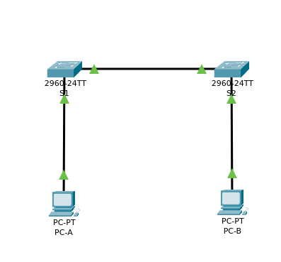

### ЗАДАННАЯ ТОПОЛОГИЯ СЕТИ ДЛЯ ЛАБОРАТОРНОЙ РАБОТЫ №2

Топология сети




# Часть 1 . Создание и настройка сети
## Шаг 1. см.топологию сети выше.
## Шаг 2. Настройте узлы ПК
- Настройка ПК на данном этапе включает в себя подключение кабеля и изменение имени узла. Отображено выше в топологии.
## Шаг 3. Выполните инициализацию и перезагрузку коммутаторов
- Инициализация коммутатора предполагает сброс его конфигурации до заводских настроек
```
Switch>enable
Switch#
Switch#erase startup-config 
Erasing the nvram filesystem will remove all configuration files! Continue? [confirm]
[OK]
Erase of nvram: complete
%SYS-7-NV_BLOCK_INIT: Initialized the geometry of nvram
Switch#
Switch#delete vlan.dat
Delete filename [vlan.dat]?y
Delete flash:/y? [confirm]y%Error deleting flash:/y (No such file or directory)
Switch#reload 
Proceed with reload? [confirm]yC2960 Boot Loader (C2960-HBOOT-M) Version 12.2(25r)FX, RELEASE SOFTWARE (fc4)
Cisco WS-C2960-24TT (RC32300) processor (revision C0) with 21039K bytes of memory.
2960-24TT starting...
Base ethernet MAC Address: 00E0.F7E3.6B93
Xmodem file system is available.
Initializing Flash...
flashfs[0]: 1 files, 0 directories
flashfs[0]: 0 orphaned files, 0 orphaned directories
flashfs[0]: Total bytes: 64016384
flashfs[0]: Bytes used: 4670455
flashfs[0]: Bytes available: 59345929
flashfs[0]: flashfs fsck took 1 seconds.
...done Initializing Flash.

Boot Sector Filesystem (bs:) installed, fsid: 3
Parameter Block Filesystem (pb:) installed, fsid: 4


Loading "flash:/2960-lanbasek9-mz.150-2.SE4.bin"...
########################################################################## [OK]
```
- По аналогии выполнена инициализация и перезагрузка коммутатора S2.

## Шаг 4. Настройте базовые параметры каждого из коммутаторов.
### а. Настройте имена устройств в соответствии с топологией
- Первый коммутатор
```
Switch>enable
Switch#configure terminal 
Enter configuration commands, one per line.  End with CNTL/Z.
Switch(config)#hostname S1
S1(config)#
S1#
%SYS-5-CONFIG_I: Configured from console by console
```
- Второй коммутатор
```
Switch>enable
Switch#configure terminal 
Enter configuration commands, one per line.  End with CNTL/Z.
Switch(config)#hostname S2
S2(config)#
```
### b. Настройте IP-адреса в соответствии с таблицей адресации.
- Коммутатор S1
```
S1#configure terminal 
Enter configuration commands, one per line.  End with CNTL/Z.
S1(config)#interface vlan 1
S1(config-if)#ip address 192.168.1.11 255.255.255.0
S1(config-if)#no shutdown

S1(config-if)#
%LINK-5-CHANGED: Interface Vlan1, changed state to up

%LINEPROTO-5-UPDOWN: Line protocol on Interface Vlan1, changed state to up
```

- Коммутатор S2
```
S2#configure terminal 
Enter configuration commands, one per line.  End with CNTL/Z.
S2(config)#interface vlan 1
S2(config-if)#ip address 192.168.1.12 255.255.255.0
S2(config-if)#no shutdown

S2(config-if)#
%LINK-5-CHANGED: Interface Vlan1, changed state to up

%LINEPROTO-5-UPDOWN: Line protocol on Interface Vlan1, changed state to up
```
### c. Назначьте cisco в качестве паролей консоли и VTY
- Коммутатор S1 настройка пароля консоли
```
S1>enable
S1#configure terminal
Enter configuration commands, one per line.  End with CNTL/Z.
S1(config)#line console 0
S1(config-line)#password cisco
S1(config-line)#login 
S1(config-line)#exit
```
- Коммутатор S1 настройка пароля VTY (виртуальной линии)
```
User Access Verification

Password: 
S1>enable
S1#configure terminal
Enter configuration commands, one per line.  End with CNTL/Z.
S1(config)#line vty 0 15
S1(config-line)#password cisco
S1(config-line)#login
S1(config-line)#transport input ssh
S1(config-line)#exit
```
- Коммутатор S2 настройка пароля консоли
```
S2>enable
S2#configure terminal 
Enter configuration commands, one per line.  End with CNTL/Z.
S2(config)#line console 0
S2(config-line)#password cisco
S2(config-line)#login
S2(config-line)#exit
```
- Коммутатор S2 настройка пароля VTY (виртуальной линии)
```
User Access Verification

Password: 

S2>enable
S2#configure terminal
Enter configuration commands, one per line.  End with CNTL/Z.
S2(config)#line vty 0 15
S2(config-line)#password cisco
S2(config-line)#login
S2(config-line)#transport input ssh
S2(config-line)#exit
```
### d. Назначьте class в качестве пароля доступа к привелегированному режиму EXEC.
- Коммутатор S1 настройка пароля EXEC
```
User Access Verification

Password: 

S1>enable
S1#configure terminal
Enter configuration commands, one per line.  End with CNTL/Z.
S1(config)#enable secret class
S1(config)#exit
S1#
%SYS-5-CONFIG_I: Configured from console by console

S1#write memory
Building configuration...
[OK]
```
- Коммутатор S2 настройка пароля EXEC
```
User Access Verification

Password: 

S2>enable
S2#configure terminal
Enter configuration commands, one per line.  End with CNTL/Z.
S2(config)#enable secret class
S2(config)#exit
S2#
%SYS-5-CONFIG_I: Configured from console by console

S2#write memory
Building configuration...
[OK]
```

# Часть 2 . Изучение таблицы MAC-адресов коммутатора
### Шаг 1. Запишите MAC-адреса сетевых устройств
#### a. Откройте командную строку на PC-A и PC-B и введите команду ipconfig /all
- Физический адрес адаптера Ethernet: MAC-адрес компьютера PC-A

```
Cisco Packet Tracer PC Command Line 1.0
C:\>ipconfig /all

FastEthernet0 Connection:(default port)

   Connection-specific DNS Suffix..: 
   #Physical Address................: 0002.1762.592D#
   Link-local IPv6 Address.........: FE80::202:17FF:FE62:592D
   IPv6 Address....................: ::
   IPv4 Address....................: 0.0.0.0
   Subnet Mask.....................: 0.0.0.0
   Default Gateway.................: ::
                                     0.0.0.0
   DHCP Servers....................: 0.0.0.0
   DHCPv6 IAID.....................: 
   DHCPv6 Client DUID..............: 00-01-00-01-2B-14-BE-71-00-02-17-62-59-2D
   DNS Servers.....................: ::
                                     0.0.0.0
```
- Физический адрес адаптера Ethernet: MAC-адрес компьютера PC-B
```
Cisco Packet Tracer PC Command Line 1.0
C:\>ipconfig /all

FastEthernet0 Connection:(default port)

   Connection-specific DNS Suffix..: 
   #Physical Address................: 0060.475D.6A4D#
   Link-local IPv6 Address.........: FE80::260:47FF:FE5D:6A4D
   IPv6 Address....................: ::
   IPv4 Address....................: 0.0.0.0
   Subnet Mask.....................: 0.0.0.0
   Default Gateway.................: ::
                                     0.0.0.0
   DHCP Servers....................: 0.0.0.0
   DHCPv6 IAID.....................: 
   DHCPv6 Client DUID..............: 00-01-00-01-DC-65-14-C6-00-60-47-5D-6A-4D
   DNS Servers.....................: ::
                                     0.0.0.0
```
#### b. Подключитесь к коммутаторам S1 и S2 через консоль и введите команду show interface F0/1 на каждом коммутаторе.
- МАС-адрес коммутатора S1 Fast Ethernet 0/1:
```
S1#show interface F0/1
FastEthernet0/1 is up, line protocol is up (connected)
  #Hardware is Lance, address is 00d0.d354.3001 (bia 00d0.d354.3001)#
```
- МАС-адрес коммутатора S2 Fast Ethernet 0/1:
```
S2#show interface F0/1
FastEthernet0/1 is up, line protocol is up (connected)
  #Hardware is Lance, address is 00e0.f975.0201 (bia 00e0.f975.0201)#
```

### Шаг 2. Просмотрите таблицу MAC-адресов коммутатора.
#### a. Подключитесь к коммутатору S2 через консоль и войдите в привилегированный режим EXEC.
```
User Access Verification

Password: 
Password: 

S2>enable
Password: 
S2#
```
#### b. В привилегированном режиме EXEC введите команду show mac address-table и нажмите клавишу ввода.
```
S2#show mac address-table
          Mac Address Table
-------------------------------------------

Vlan    Mac Address       Type        Ports
----    -----------       --------    -----

   1    00d0.d354.3002    DYNAMIC     Fa0/1
```
#### Записаны ли в таблице МАС-адресов какие-либо МАС-адреса? 
- Ответ: Нет
#### Какие МАС-адреса записаны в таблице? С какими портами коммутатора они сопоставлены и каким устройствам принадлежат? Игнорируйте МАС-адреса, сопоставленные с центральным процессором. 
- Ответ: В таблице записан MAC-адрес VLAN 1 коммутатора S2, данный адрес сопоставлен с портом Fa 0/1
#### Если вы не записали МАС-адреса сетевых устройств в шаге 1, как можно определить, каким устройствам принадлежат МАС-адреса, используя только выходные данные команды show mac address-table? Работает ли это решение в любой ситуации?
- Да, данное решение может работать в любой ситуации, так как утверждение, что MAC-адреса могут отображаться даже в том случае , если echo запросы не отправлялись. ARP протокол позволяет получить данную информацию. 

### Шаг 3. Очистите таблицу МАС-адресов коммутатора S2 и снова отобразите таблицу МАС-адресов.
#### a. В привилегированном режиме EXEC введите команду clear mac address-table dynamic и нажмите клавишу Enter.
```
S2#clear mac address-table dynamic
```
#### b. Снова быстро введите команду show mac address-table.
```
S2#show mac address-table
          Mac Address Table
-------------------------------------------

Vlan    Mac Address       Type        Ports
----    -----------       --------    -----

S2#
```
- В табице отсутствуют MAC-адреса
- Ввод show mac address-table спустя некоторое время (Адреса появились с помощью процесса ND)
```
S2#show mac address-table
          Mac Address Table
-------------------------------------------

Vlan    Mac Address       Type        Ports
----    -----------       --------    -----

   1    00d0.d354.3002    DYNAMIC     Fa0/1
```

### Шаг 4. С компьютера PC-B отправьте эхо-запросы устройствам в сети и просмотрите таблицу МАС-адресов коммутатора.
#### a. На компьютере PC-B откройте командную строку и еще раз введите команду arp -a
```
C:\>arp -a
No ARP Entries Found
```
#### b. Из командной строки PC-B отправьте эхо-запросы на компьютер PC-A, а также коммутаторы S1 и S2
- Отправка эхо-запроса на компьютер PC-A
```
C:\>ping 192.168.1.1

Pinging 192.168.1.1 with 32 bytes of data:

Reply from 192.168.1.1: bytes=32 time<1ms TTL=128
Reply from 192.168.1.1: bytes=32 time<1ms TTL=128
Reply from 192.168.1.1: bytes=32 time=1ms TTL=128
Reply from 192.168.1.1: bytes=32 time<1ms TTL=128

Ping statistics for 192.168.1.1:
    Packets: Sent = 4, Received = 4, Lost = 0 (0% loss),
Approximate round trip times in milli-seconds:
    Minimum = 0ms, Maximum = 1ms, Average = 0ms
```
- Отправка эхо-запроса на коммутатор S1
```
C:\>ping 192.168.1.11

Pinging 192.168.1.11 with 32 bytes of data:

Request timed out.
Reply from 192.168.1.11: bytes=32 time<1ms TTL=255
Reply from 192.168.1.11: bytes=32 time<1ms TTL=255
Reply from 192.168.1.11: bytes=32 time<1ms TTL=255

Ping statistics for 192.168.1.11:
    Packets: Sent = 4, Received = 3, Lost = 1 (25% loss),
Approximate round trip times in milli-seconds:
    Minimum = 0ms, Maximum = 0ms, Average = 0ms
```
- Отправка эхо-запроса на коммутатор S2
```

C:\>ping 192.168.1.12

Pinging 192.168.1.12 with 32 bytes of data:

Request timed out.
Reply from 192.168.1.12: bytes=32 time<1ms TTL=255
Reply from 192.168.1.12: bytes=32 time<1ms TTL=255
Reply from 192.168.1.12: bytes=32 time<1ms TTL=255

Ping statistics for 192.168.1.12:
    Packets: Sent = 4, Received = 3, Lost = 1 (25% loss),
Approximate round trip times in milli-seconds:
    Minimum = 0ms, Maximum = 0ms, Average = 0ms
```
#### c. Из командной строки PC-B отправьте эхо-запросы на компьютер PC-A, а также коммутаторы S1 и S2

```
S2#show mac address-table
          Mac Address Table
-------------------------------------------

Vlan    Mac Address       Type        Ports
----    -----------       --------    -----

   1    0002.1762.592d    DYNAMIC     Fa0/1
   1    0060.475d.6a4d    DYNAMIC     Fa0/2
   1    00d0.d354.3002    DYNAMIC     Fa0/1
   1    00e0.f7e3.6b93    DYNAMIC     Fa0/1
```
- ARP-кэш обновлен
```
C:\>arp -a
  Internet Address      Physical Address      Type
  192.168.1.1           0002.1762.592d        dynamic
  192.168.1.11          00e0.f7e3.6b93        dynamic
  192.168.1.12          0009.7c13.3b9b        dynamic
```