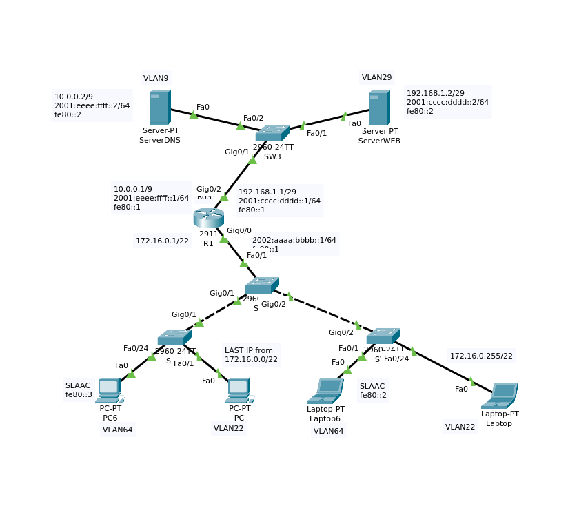
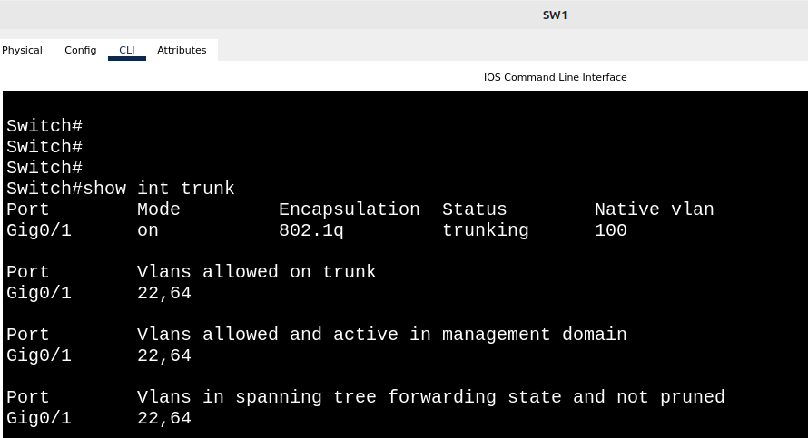
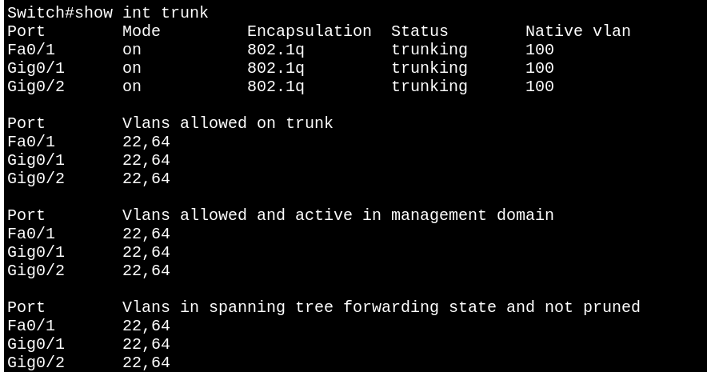
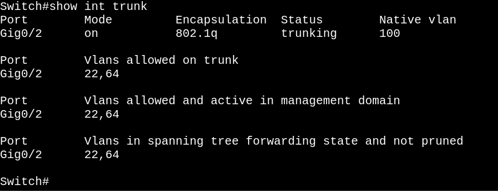
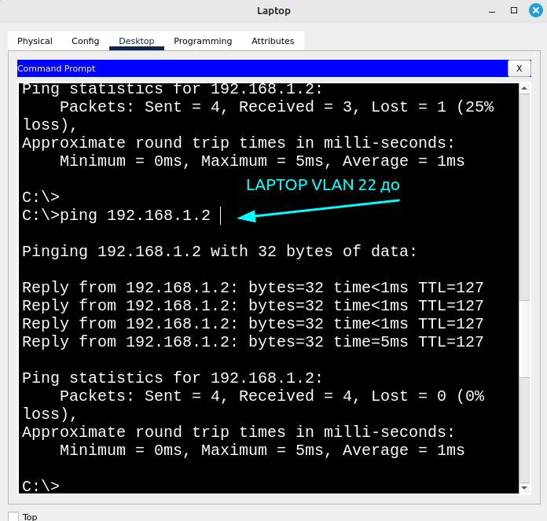
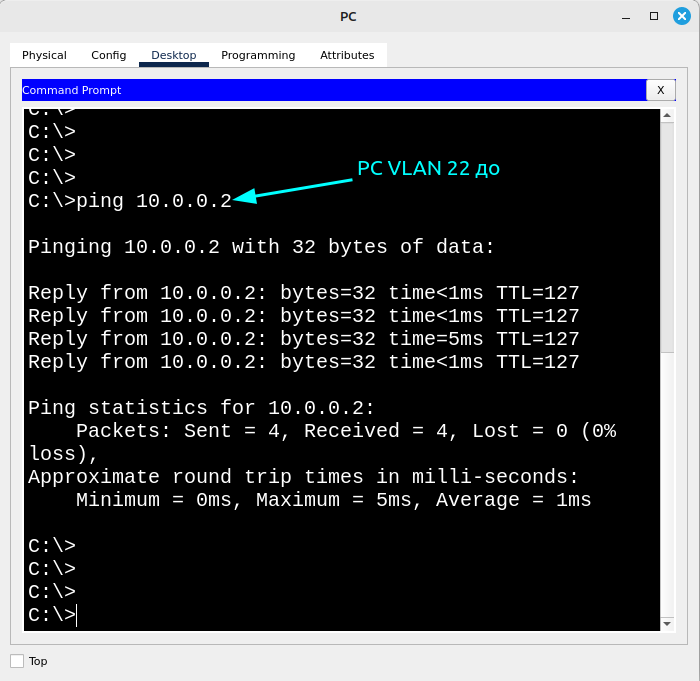
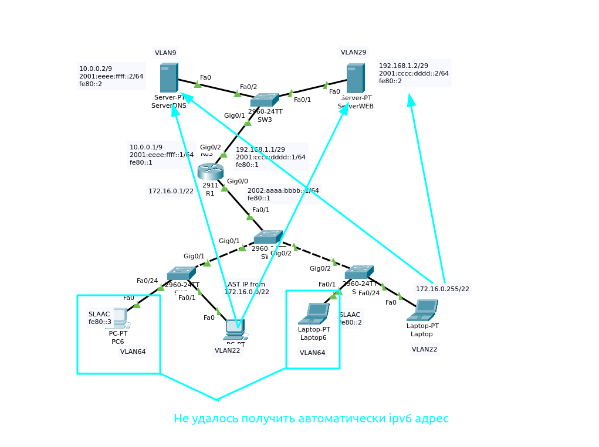

# Топология сети практического занятия 


Цели и задачи 
Настроить ipv-4 ipv6 маршрутизацию и обеспечить взаимодействие с PC до серверов.

### Создание VLAN на коммутаторах 2-го и 3-го уровней нижнего сегмента топологии

SW1 (На скриншоте результат ввода команд указанных ниже)



```
Switch>enable
Switch#conf t
Enter configuration commands, one per line.  End with CNTL/Z.
Switch(config)#
Switch(config)#
Switch(config)#vlan 64
Switch(config-vlan)#ex
Switch(config)#vlan 22
Switch(config-vlan)#ex
Switch(config)#vlan 50
Switch(config-vlan)#ex
Switch(config)#vlan 100
Switch(config-vlan)#ex
Switch(config)#int Fa0/24
Switch(config-if)#switchport mode access
Switch(config-if)#switchport access vlan 64
Switch(config-if)#ex
Switch(config)#
Switch(config)#int Fa0/1
Switch(config-if)#switchport mode access
Switch(config-if)#switchport access vlan 22
Switch(config-if)#ex
Switch(config)#int range Fa0/2-23
Switch(config-if-range)#switchport mode access
Switch(config-if-range)#switchport access vlan 50
Switch(config-if-range)#
Switch(config)#int gig0/2
Switch(config-if)#switchport mode access 
Switch(config-if)#switchport access vlan 50
Switch(config)#int gig0/1
Switch(config-if)#switchport mode trunk
Switch(config-if)#switchport trunk native vlan 100
Switch#show interfaces gig0/1 switchport
Trunking Native Mode VLAN: 100 (VLAN0100)
Switch(config-if)#switchport trunk allowed vlan 64,22
Switch(config)#int gig0/1
Switch(config-if)#switchport nonegotiate
```
SW0 (На скриншоте результат ввода команд указанных ниже)


```
Switch(config)#vlan 64
Switch(config-vlan)#ex
Switch(config)#vlan 22
Switch(config-vlan)#ex
Switch(config)#vlan 50
Switch(config-vlan)#ex
Switch(config)#vlan 100
Switch(config)#int range Fa0/2-24
Switch(config-if-range)#switchport mode access
Switch(config-if-range)#switchport access vlan 50
Switch(config)#int range gig0/1, gig0/2
Switch(config-if-range)#switchport mode trunk
Switch(config-if-range)#switchport trunk native vlan 100
Switch(config-if-range)#switchport trunk allowed vlan 64,22
Switch(config-if-range)#switchport nonegotiate
Switch(config-if)#switchport mode trunk 
Switch(config-if)#switchport trunk native vlan 100
Switch(config-if)#switchport trunk allowed vlan 64,22
Switch(config-if)#switchport nonegotiate
```
SW2 (На скриншоте результат ввода команд указанных ниже)


```
Switch>enable
Switch#conf t
Switch(config)#vlan 64
Switch(config-vlan)#ex
Switch(config)#vlan 22
Switch(config-vlan)#ex
Switch(config)#vlan 50
Switch(config-vlan)#ex
Switch(config)#vlan 100
Switch(config-vlan)#ex
Switch(config)#int Fa0/1
Switch(config-if)#switchport mode access
Switch(config-if)#switchport access vlan 64
Switch(config-if)#ex
Switch(config)#int Fa0/24
Switch(config-if)#switchport mode access
Switch(config-if)#switchport access vlan 22
Switch(config-if)#
Switch(config-if)#ex
Switch(config)#int Fa0/2-23
Switch(config)#int range Fa0/2-23
Switch(config-if-range)#switchport mode access
Switch(config-if-range)#switchport access vlan 50
Switch(config)#int gig0/2
Switch(config-if)#switchport mode trunk
Switch(config-if)#switchport trunk allowed vlan 100
Switch(config-if)#switchport trunk native vlan 100
Switch(config-if)#switchport trunk allowed vlan 64,22
Switch(config-if)#switchport nonegotiate
Switch(config)#int gig0/1
Switch(config-if)#
Switch(config-if)#switchport access vlan 50
```

### Создание на маршрутизаторе R1 подинтерфейсов и назначение ip-адресов интерфейсам.

```
Router(config)#int gig0/0.22
Router(config-subif)#encapsulation dot1Q 22
Router(config-subif)#ip address 172.16.0.1 255.255.252.0

Router(config)#int gig0/0.64
Router(config-subif)#encapsulation dot1Q 64
Router(config-subif)#ipv6 address 2002:aaaa:bbbb::1/64

Router(config)#int gig 0/2.9
Router(config-subif)#encapsulation dot1Q 9
Router(config-subif)#ip address 10.0.0.1 255.128.0.0
Router(config-subif)#ipv6 address 2001:eeee:ffff::1/64
Router(config)#int gig0/2.29
Router(config-subif)#ip address 192.168.1.1 255.255.255.248
Router(config-subif)#ipv6 address 2001:cccc:dddd::1/64
Router(config)#ipv6 unicast-routing


```


### Настройка коммутатора SW 3 Верхней части топологии

```
Switch>enable
Switch#conf t
Switch(config)#
Switch(config)#
Switch(config)#vlan 9
Switch(config-vlan)#ex
Switch(config)#vlan 29
Switch(config-vlan)#ex
Switch(config)#vlan 50
Switch(config-vlan)#ex
Switch(config)#vlan 100
Switch(config)#int Fa0/1
Switch(config-if)#switchport mode access
Switch(config-if)#switchport access vlan 29
Switch(config)#int Fa0/2
Switch(config-if)#switchport mode access
Switch(config-if)#switchport access vlan 9
Switch(config-if)#int range Fa0/3-24
Switch(config-if-range)#switchport mode access
Switch(config-if-range)#switchport access vlan 50
Switch(config)#int gig0/2
Switch(config-if)#switchport mode access
Switch(config-if)#switchport access vlan 50
Switch(config)#int gig0/1
Switch(config-if)#switchport mode trunk
Switch(config-if)#switchport trunk native vlan 100
Switch(config-if)#switchport trunk allowed vlan 29,9
Switch(config-if)#switchport nonegotiate
```


### Обеспечение маршрутизации для связи vlan 22 c vlan 9,29

```
Router(config)#ip route 192.168.1.2 255.255.255.248 gig0/0.64
Router(config)#ip route 10.0.0.1 255.128.0.0 gig0/0.22
```

#### Проверка связи от pc vlan 22 до vlan 29,9




