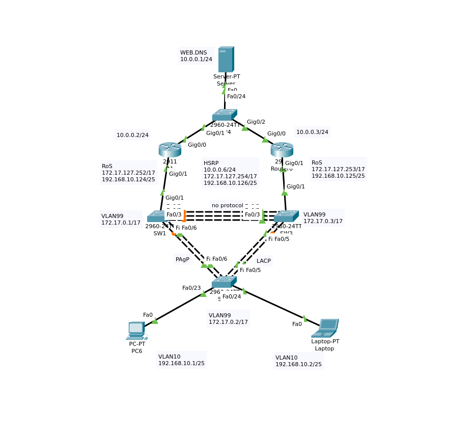
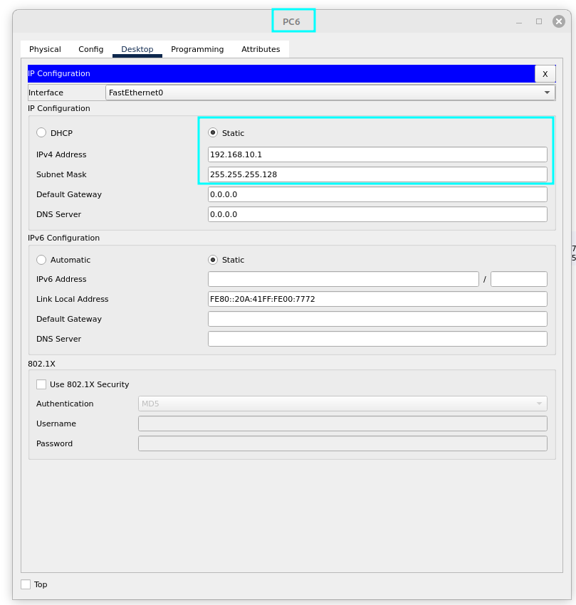
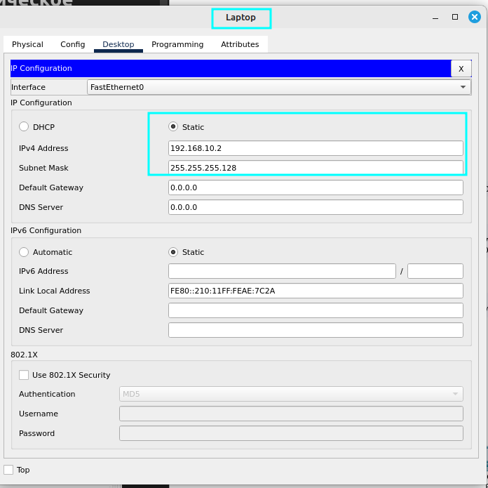
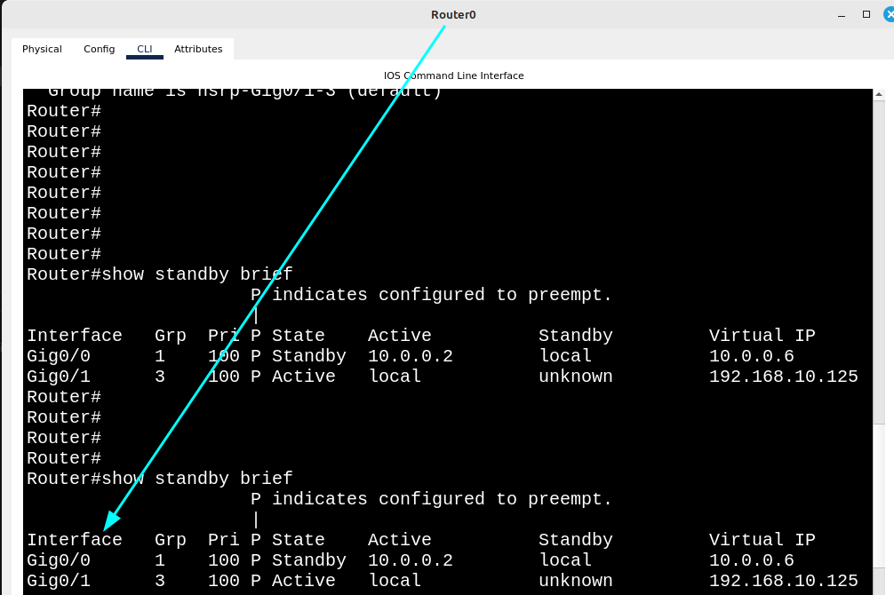
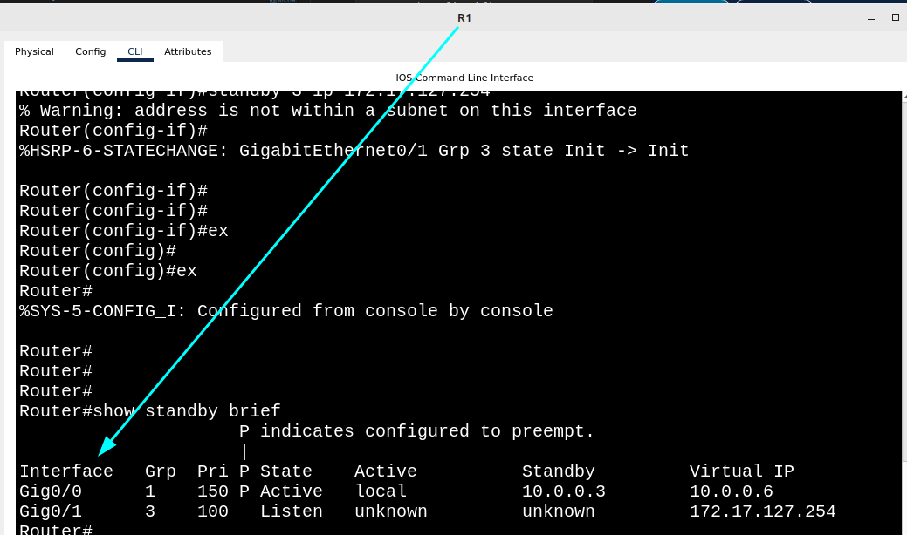
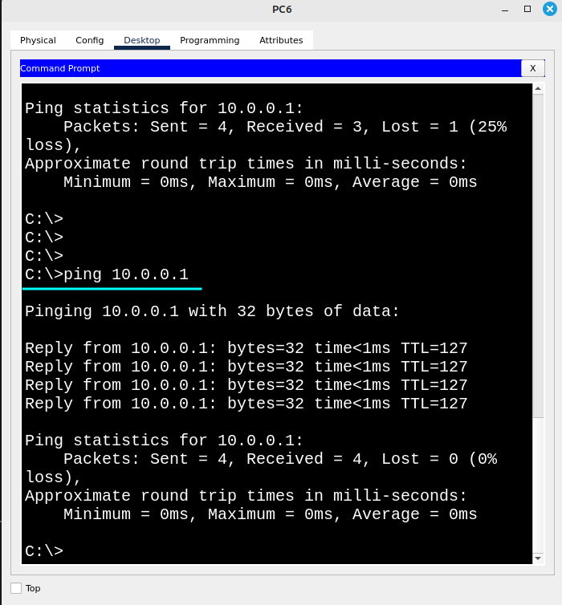
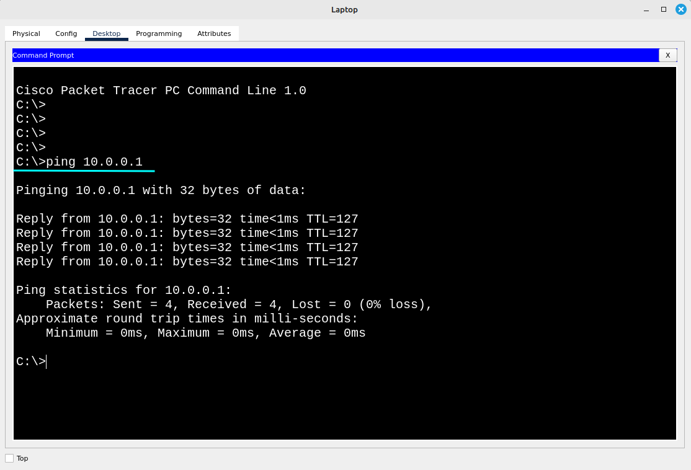
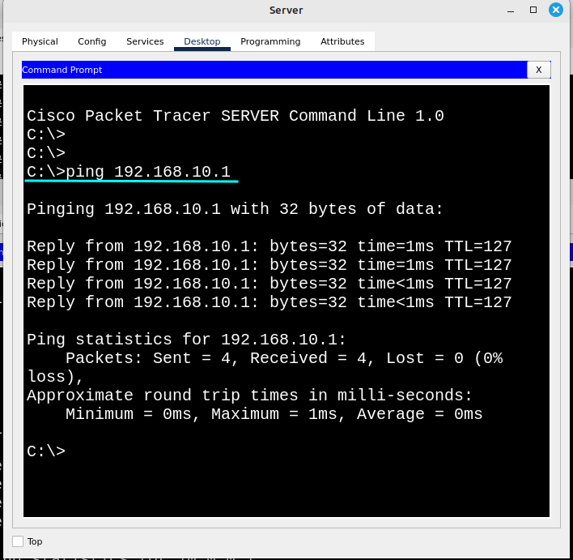

# Организация Сети с избыточностью (практическое занятие)
## Топология лабораторной работы 



### Настройка компьютеров PC6 и Laptop




### Настройка коммутатора Sw2

- Создание Vlan, добавление Vlan на интерфейсы fa0/23-24
```
Switch(config)#vlan 10
Switch(config)#ex
Switch(config)#vlan 99
Switch(config-vlan)#ex
Switch(config)#vlan 100
Switch(config)#int range fa0/23-24
Switch(config-if-range)#switchport mode access
Switch(config-if-range)#switchport access vlan 10
```

- Агрегация интерфейсов 
Fa0/6-7 и Fa0/4-5 в каналы а также установка транкового соединения к коммутаторам SW1 и SW3
```
Sw2(config)#int range fa0/6-7
Sw2(config-if-range)#channel-group 1 mode ?
  active     Enable LACP unconditionally
  auto       Enable PAgP only if a PAgP device is detected
  desirable  Enable PAgP unconditionally
  on         Enable Etherchannel only
  passive    Enable LACP only if a LACP device is detected
Sw2(config-if-range)#channel-group 1 mode auto
Sw2(config-if-range)#switchport mode trunk
Sw2(config-if-range)#switchport trunk allowed vlan 10,99
Sw2(config-if-range)#switchport trunk native vlan 100
Sw2(config)#int range fa0/4-5
Sw2(config-if-range)#channel-group 2 mode passive
Sw2(config-if-range)#switchport mode trunk
Sw2(config-if-range)#switchport trunk allowed 10,99
Sw2(config-if-range)#switchport trunk native vlan 100
Sw2#show eth summary
Flags:  D - down        P - in port-channel
        I - stand-alone s - suspended
        H - Hot-standby (LACP only)
        R - Layer3      S - Layer2
        U - in use      f - failed to allocate aggregator
        u - unsuitable for bundling
        w - waiting to be aggregated
        d - default port


Number of channel-groups in use: 2
Number of aggregators:           2

Group  Port-channel  Protocol    Ports
------+-------------+-----------+----------------------------------------------

1      Po1(SD)           PAgP   Fa0/6(I) Fa0/7(I) 
2      Po2(SD)           LACP   Fa0/4(I) Fa0/5(I)
Sw2(config-if)#int vlan 99
Sw2(config-if)#ip address 172.17.0.2 255.255.128.0
```


### Настройка коммутатора SW1

- Создание VLAN и Агрегация интерфейсов Fa0/6-7 в каналы, а также установка транкового соединения к коммутатору SW1
```
Switch(config)#vlan 10
Switch(config-vlan)#ex
Switch(config)#
Switch(config)#vlan 99
Switch(config-vlan)#
Switch(config-vlan)#ex
Switch(config)#
Switch(config)#vlan 100
Switch(config)#int range fa0/6-7
Switch(config-if-range)#channel-group 1 mode auto
Switch(config)#int range fa0/6-7
Switch(config-if-range)#switchport mode trunk
Switch(config-if-range)#switchport trunk allowed vlan 10,99
Switch(config-if-range)#switchport trunk native vlan 100
Switch(config)#int vlan 99
Switch(config-if)#ip address 172.17.0.1 255.255.128.0
```

- Агрегация интерфейсов Fa0/1-3 и настройка транкового соединения к коммутатору SW3 и Маршрутизатору
```
Switch(config)#int gig0/1
Switch(config-if)#switchport mode trunk
Switch(config-if)#switchport trunk allowed vlan 10,99
Switch(config-if)#switchport trunk native vlan 100
Switch(config)#int range fa0/1-3
Switch(config-if)#channel-group 3 mode on
Switch(config)#ex
Switch(config-if)#int range fa0/1-3 
Switch(config-if)#switchport mode trunk
Switch(config-if)#switchport trunk allowed vlan 10,99
Switch(config-if)#switchport trunk native vlan 100
Switch(config-if)shutdown
```


### Настройка коммутатора SW3

- Агрегация интерфейсов Fa0/1-3 и настройка транкового соединения к коммутатору SW1 и Маршрутизатору
```
Switch(config)#int gig0/1
Switch(config-if)#switchport mode trunk
Switch(config-if)#switchport trunk allowed vlan 10,99
Switch(config-if)#switchport trunk native vlan 100
Switch(config)#vlan 10
Switch(config-vlan)#ex
Switch(config)#
Switch(config)#vlan 99
Switch(config-vlan)#
Switch(config-vlan)#ex
Switch(config)#
Switch(config)#vlan 100
Switch(config)#int range fa0/4-5
Switch(config-if-range)#channel-group 2 mode passive
Switch(config)#int range fa0/4-5
Switch(config-if-range)#switchport mode trunk
Switch(config-if-range)#switchport trunk allowed vlan 10,99
Switch(config-if-range)#switchport trunk native vlan 100
Switch(config)#int vlan 99
Switch(config-if)#ip address 172.17.0.3 255.255.128.0
Switch(config)#int range fa0/1-5
Switch(config-if)#shutdown
```


### Настройка маршрутизатора R1
```
Router(config)#int gig 0/0
Router(config-if)#ip address 10.0.0.2 255.255.255.0
Router(config)#int gig0/1.99
Router(config-subif)#encapsulation dot1Q 99
Router(config-subif)#ip address 172.17.127.252 255.255.128.0
Router(config-subif)#int gig0/1.10
Router(config-subif)#encapsulation dot1Q 10
Router(config-subif)#ip address 192.168.10.124 255.255.255.128
Router(config)#int gig0/0
Router(config-if)#
Router(config-if)#standby version 2
Router(config-if)#standby 1 ip 10.0.0.6
Router(config-if)#standby 1 preempt
Router(config-if)#no shutdown
Router(config)#int gig0/1.10
Router(config-subif)#encapsulation dot1Q 10
Router(config-subif)#ip address 192.168.10.124 255.255.255.128
Router(config-subif)#
Router(config-subif)#no shutdown
Router(config-subif)#ex
Router(config)#int gig0/1.99
Router(config-subif)#encapsulation dot1Q 99
Router(config-subif)#ip address 172.17.127.252 255.255.128.0
Router(config-subif)#no shutdown 

```


### Настройка маршрутизатора R0

```
Router(config)#int gig 0/0
Router(config-if)#ip address 10.0.0.3 255.255.255.0
Router(config-if)#standby version 2
Router(config-if)#standby 1 ip 10.0.0.6
Router(config-if)#standby 1 preempt 
Router(config-if)#no shutdown
Router(config)#int gig0/1.10
Router(config-subif)#encapsulation dot1Q 10 
Router(config-subif)#ip address 192.168.10.1 255.255.255.128 
Router(config-subif)#no shutdown
Router(config-subif)#ex
Router(config)#int gig0/1.99
Router(config-subif)#encapsulation dot1Q 99
Router(config-subif)#ip address 172.17.127.253 255.255.128.0
Router(config-subif)#no shutdown
Router(config-subif)#

```

- Отображение standby групп на маршрутизаторах




### Настройка коммутатора SW4

```
Router(config)#int range gig0/1-2
Switch(config-if-range)#switchport mode access
Switch(config-if-range)#switchport access vlan 10
Switch(config)#int fa0/24
Switch(config-if)#switchport mode access
Switch(config-if)#switchport access vlan 10
```


# Проверка соединения между Сервером (10.0.0.1) и компьютерами.


