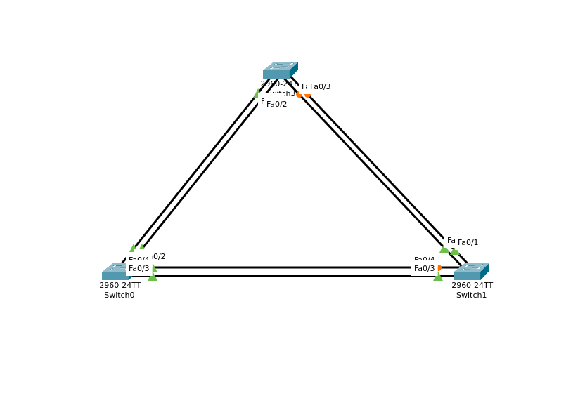
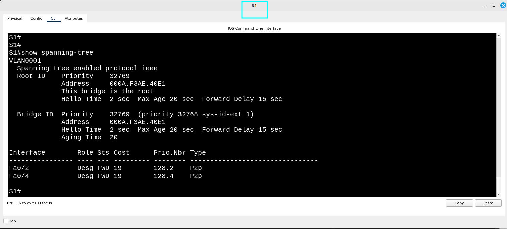
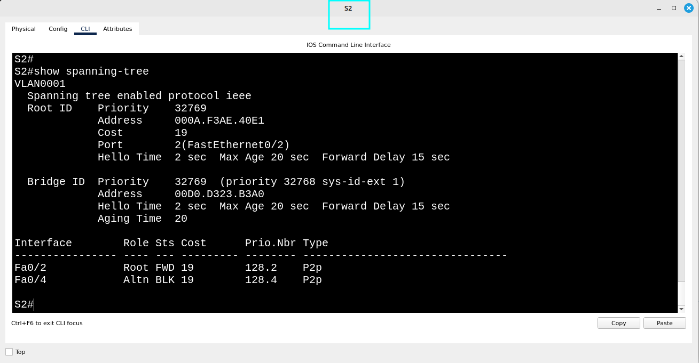
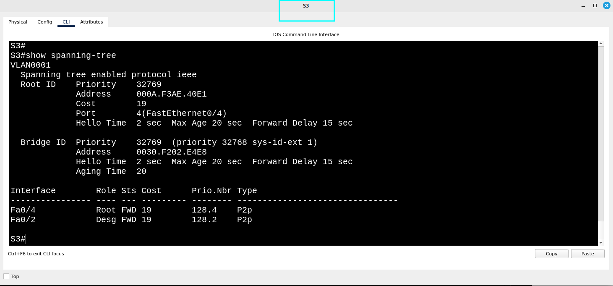
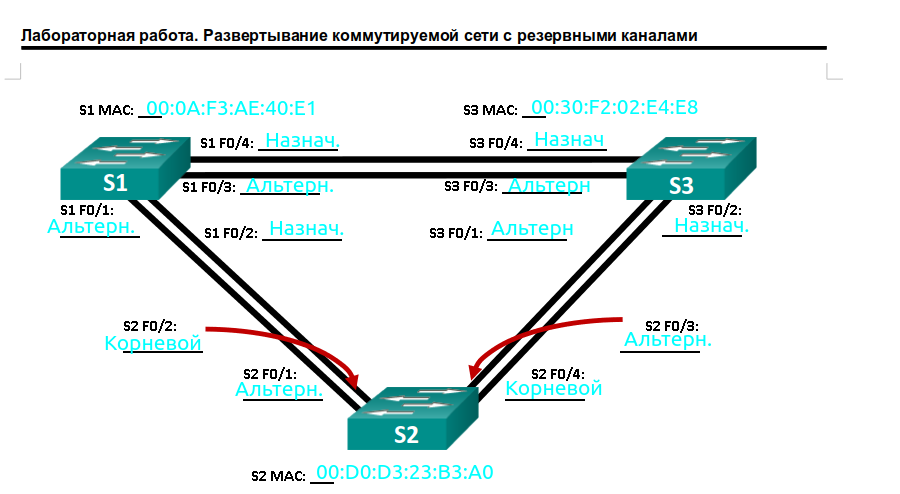
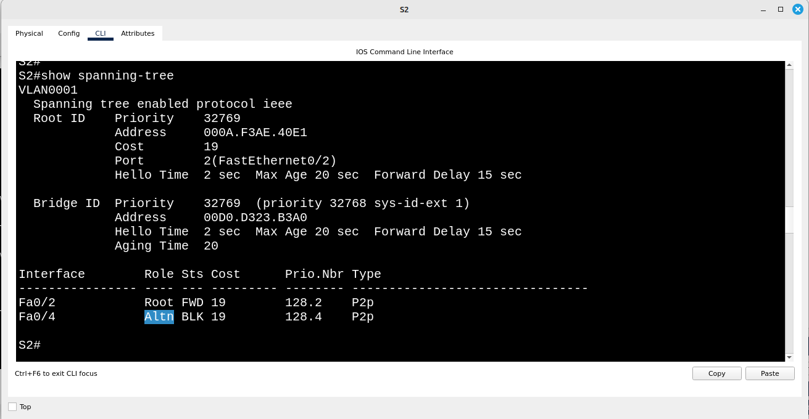
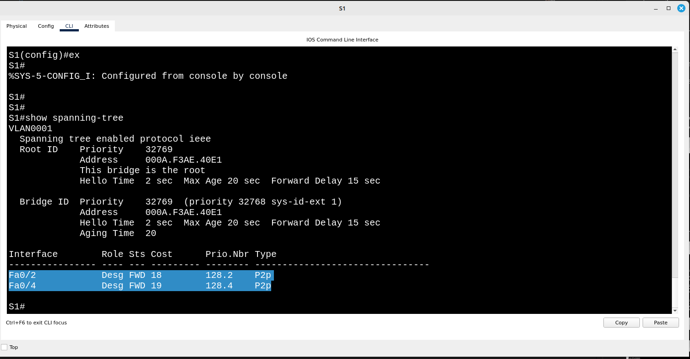
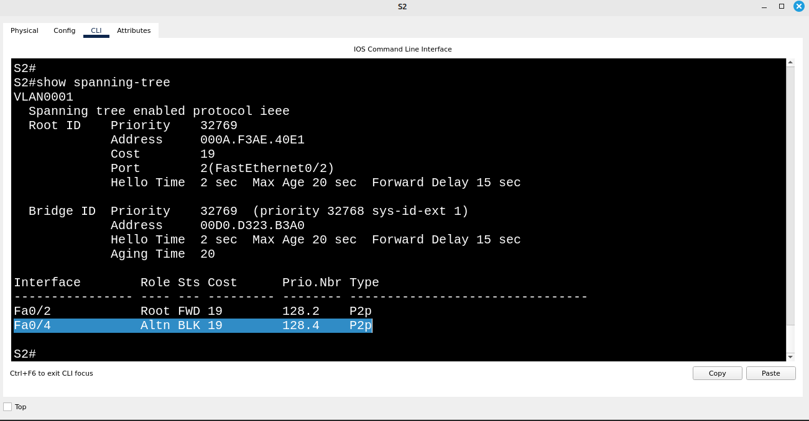
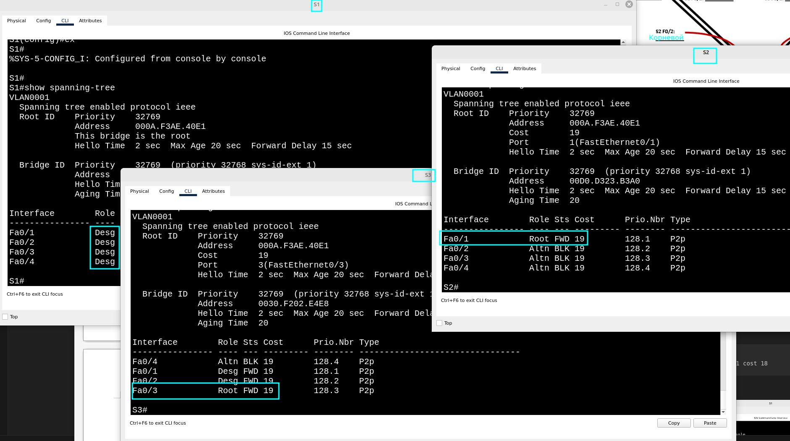

Топология сети данной лабораторной работы



### Часть 1: Создание сети и настройка основных параметров устройства.

#### Шаг 1,2,3 4

#### Базовые параметры и инициализация коммутатора S1
```
Switch>enable
Switch#
Switch#configure terminal
Switch(config)#hostname S1
Switch(config) no ip domain-lookup
Switch(config) enable password class
S1(config)#line vty 0 15
S1(config-line)#password cisco
S1(config-line)#login
S1(config-line)#service password-encryption
S1(config)#line console 0
S1(config-line)#password cisco
S1(config-line)#service password-encryption
S1(config)#line console 0
S1(config-line)#login 
S1(config-line)#logging synchronous 
S1(config-line)#banner motd #Caution#
S1(config)#line vty 0 15
S1(config-line)#banner motd #Caution#
S1(config)#int vlan1
S1(config-if)#no shutdown
S1(config-if)#ip address 192.168.1.1 255.255.255.0

```


#### Базовые параметры и инициализация коммутатора S2
```
S2>enable
S2#conf t
S2(config)#hostname S2
S2(config)#no ip domain-lookup
S2(config)#enable password class
S2(config)#service password-encryption
S2(config)#line vty 0 15
S2(config-line)#password cisco
S2(config-line)#service password-encryption
S2(config)#line vty 0 15
S2(config-line)#login
S2(config)#line console 0
S2(config-line)#password cisco
S2(config-line)#service password-encryption 
S2(config)#line console 0
S2(config-line)#login	
S2(config-line)#logging synchronous
S2(config-line)#banner motd #Caution#
S2(config)#line vty 0 15
S2(config-line)#banner motd #Caution#
S2(config)#int vlan1
S2(config-if)#no shutdown
S2(config-if)#ip address 192.168.1.2 255.255.255.0
```


#### Базовые параметры и инициализация коммутатора S3
```
Switch>enable
Switch#conf t
Switch(config)#hostname S3
S3(config)#no ip domain-lookup
S3(config)#enable password class
S3(config)#service password-encryption
S3(config)#
S3(config)#line vty 0 15
S3(config-line)#password cisco
S3(config-line)#service password-encryption 
S3(config)#login
S3(config)#line vty 0 15
S3(config-line)#banner motd #Caution#
S3(config)#line console 0
S3(config-line)#password cisco
S3(config-line)#service password-encryption
S3(config)#line console 0
S3(config-line)#login
S3(config-line)#logging synchronous 
S3(config-line)#banner motd #Caution#
S3(config)#int vlan1
S3(config-if)#ip address 192.168.1.3 255.255.255.0
S3(config-if)#no shutdown
```

#### Шаг4: Проверка эхо-запросов.

Успешно ли выполняется эхо-запрос от коммутатора S1 на коммутатор S2?
```
S1>ping 192.168.1.2

Type escape sequence to abort.
Sending 5, 100-byte ICMP Echos to 192.168.1.2, timeout is 2 seconds:
!!!!!
Success rate is 100 percent (5/5), round-trip min/avg/max = 0/0/0 ms
```
Успешно ли выполняется эхо-запрос от коммутатора S1 на коммутатор 
S3?
```
S1>ping 192.168.1.3

Type escape sequence to abort.
Sending 5, 100-byte ICMP Echos to 192.168.1.3, timeout is 2 seconds:
..!!!
Success rate is 60 percent (3/5), round-trip min/avg/max = 0/0/0 ms

S1>ping 192.168.1.3

Type escape sequence to abort.
Sending 5, 100-byte ICMP Echos to 192.168.1.3, timeout is 2 seconds:
!!!!!
Success rate is 100 percent (5/5), round-trip min/avg/max = 0/0/0 ms
```
Успешно ли выполняется эхо-запрос от коммутатора S2 на коммутатор S3?
```
S2>ping 192.168.1.3

Type escape sequence to abort.
Sending 5, 100-byte ICMP Echos to 192.168.1.3, timeout is 2 seconds:
..!!!
Success rate is 60 percent (3/5), round-trip min/avg/max = 0/0/0 ms

S2>
S2>
S2>ping 192.168.1.3

Type escape sequence to abort.
Sending 5, 100-byte ICMP Echos to 192.168.1.3, timeout is 2 seconds:
!!!!!
Success rate is 100 percent (5/5), round-trip min/avg/max = 0/0/0 ms
```


# Часть 2. Определение корневого моста.

### Шаг 1,2,3,4

#### Отключение портов на коммутаторах s1,s2,s3

отключение портов на коммутаторе s1
```
S1(config)#int range fa0/1,fa0/2
S1(config-if-range)#shutdown
S1(config)#int range gig0/1,gig0/2
S1(config-if-range)#shutdown
S1(config)#int fa0/3
S1(config-if)#shutdown
S1(config)#int fa0/2
S1(config-if)#no shutdown
S1(config)#int range fa0/4,fa0/2
S1(config-if-range)#switchport mode trunk
```

отключение портов на коммутаторе s2
```
S2(config)#int fa0/3
S2(config-if)#shutdown
S2(config)#int range fa0/2,fa0/4
S2(config-if-range)#
S2(config-if-range)#
S2(config-if-range)#switchport mode trunk
S2(config-if-range)#switchport trunk allowed vlan 1
```

отключение портов на коммутаторе s2 (необязательно)
```
S3(config)#int range fa0/3,fa0/4
S3(config-if-range)#switchport mode trunk
S3(config-if-range)#switchport trunk allowed vlan 1
```


#### Отображение данных протокола spanning-tree на коммутаторах s1,s2,s3







S1 является корневый мостом выбран из-за самого низкого мак адреса 



#### Часть 3 
#### Шаг 1

#### Шаг2 
Изменение стоимости порта
```
S1(config)#int fa0/2
S1(config-if)#spanning-tree vlan 1 cost 18
```
#### Шаг3



Почему протокол spanning-tree заменяет ранее заблокированный порт на назначенный порт и блокирует порт, который был назначенным портом на другом коммутаторе? Ответ: так как значение cost изменилось с 19 на 18 произошло переназначение портов и приоритет изменился.


#### Шаг4 Удалите изменения стоимости порта

```
S1(config)#int f0/2
S1(config-if)#
S1(config-if)#
S1(config-if)#no spanning-tree vlan 1 cost 18
```

#### Часть 4.

Включение портов fa0/3,fa0/1 для коммутаторов s1,s2,s3

```
S1(config)#int range fa0/3,fa0/1
S1(config-if-range)#
S1(config-if-range)#
S1(config-if-range)#no shutdown
S2(config)#int range fa0/1,fa0/3
S2(config-if-range)#no shutdown
S3(config)#int range fa0/1,fa0/3
S3(config-if-range)#no shutdown
```



Какой порт выбран протоколом STP в качестве порта корневого моста на каждом коммутаторе некорневого моста? 
Ответ: на S2 Fa0/1; на S3 Fa0/3
Почему протокол STP выбрал эти порты в качестве портов корневого моста на этих коммутаторах? 
Ответ: порты выбраны потому что не нужно делать хоп через дополнительное устройство. 