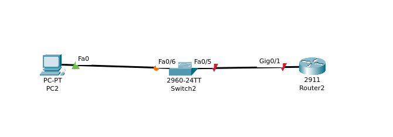
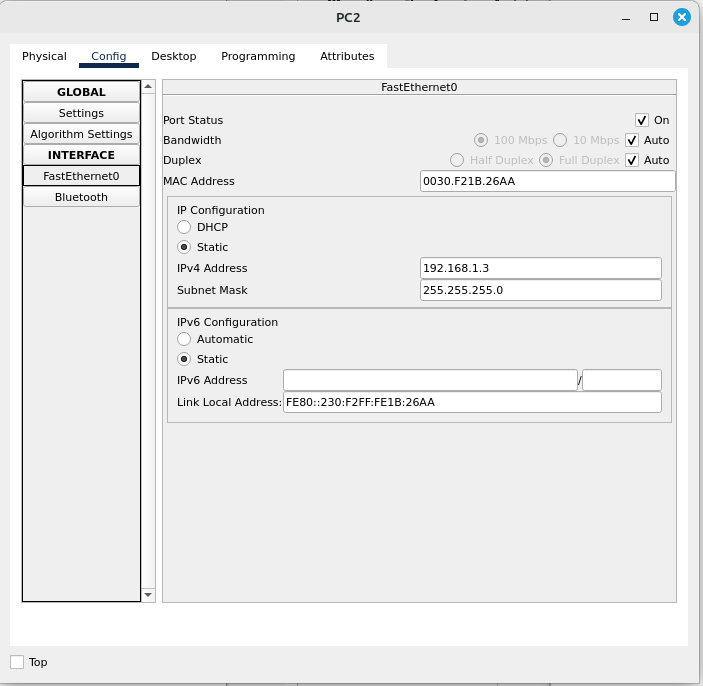

# Лабораторная работа. Доступ к сетевым устройствам по протоколу SSH.

## Топология сети для лабораторной работы 


### Часть 1. Настройка основных параметров устройств.

#### Шаг1. Сеть создана согласно топологии
#### Шаг2. Выполните инициализацию и перезагрузку маршрутизатора и коммутатора
- Коммутатор
```
Switch>enable
Switch#conf t
Switch(config)#hostname S1
Switch>enable
Switch#reload
Proceed with reload? [confirm]
```
- Маршрутизатор
```
Router>enable
Router#conf t
Enter configuration commands, one per line.  End with CNTL/Z.
Router(config)#hostname R1
R1#reload
System configuration has been modified. Save? [yes/no]:yes
Building configuration...
[OK]
Proceed with reload? [confirm]
```

#### Шаг3. Настройте маршрутизатор
- a,b,c
```
R1>enable
R1#conf t
R1(config)#no ip domain-lookup
R1(config)#exit
R1#
%SYS-5-CONFIG_I: Configured from console by console
write memory
Building configuration...
[OK]
R1#copy running-config startup-config
R1#reload
```
- d
```
R1(config)#enable password class
```
- e 
```
R1(config)#line console 0
R1(config-line)#password cisco
R1(config-line)#
R1(config-line)#login
R1(config-line)#
```
- f 
```
R1(config)#line vty 5 15
R1(config-line)#password cisco
```
- g
```
R1(config)#service password-encryption
```
- h
```
R1(config)#banner motd "WARNING"
```
- i
```
R1(config)#int g0/1
R1(config-if)#ip address 192.168.1.1 255.255.255.0
```
- j
```
R1#copy running-config startup-config
Destination filename [startup-config]? 
Building configuration...
[OK]
```

#### Шаг 4. Настройте компьютер PC-A


#### Шаг 5. Проверьте подключение к сети.
##### Предварительно активирован интерфейс Vlan1 c портом fa0/5 на Коммутаторе и интерфейс G0/1 на Маршрутизаторе
- Коммутатор
```
S1(config)#int vlan1
S1(config-if)#ip address 192.168.1.11 255.255.255.0
S1(config-if)#exit
S1(config)#int vlan1
S1(config-if)#no shutdown
S1(config)#int fa0/5
S1(config-if)#no shutdown
```
- Маршрутизатор
```
R1(config)#interface GigabitEthernet0/1
R1(config-if)#ip address 192.168.1.1 255.255.255.0
R1(config-if)#no shutdown

```
- Проверка соединения
```
C:\>ping 192.168.1.1

Pinging 192.168.1.1 with 32 bytes of data:

Reply from 192.168.1.1: bytes=32 time=1ms TTL=255
Reply from 192.168.1.1: bytes=32 time<1ms TTL=255
Reply from 192.168.1.1: bytes=32 time<1ms TTL=255
Reply from 192.168.1.1: bytes=32 time<1ms TTL=255

Ping statistics for 192.168.1.1:
    Packets: Sent = 4, Received = 4, Lost = 0 (0% loss),
Approximate round trip times in milli-seconds:
    Minimum = 0ms, Maximum = 1ms, Average = 0ms
```

# Часть2. Настройка маршрутизатора для доступа по протоколу SSH

### Шаг 1. Настройте аутентификацию устройств

- a,b

```
R1(config)#hostname R1
R1(config)#ip domain-name NewGen
```

### Шаг 2. Создайте ключ шифрования с указанием его длины 
```
R1(config)#crypto key generate rsa general-keys modulus 2048
The name for the keys will be: R1.NewGen

% The key modulus size is 2048 bits
% Generating 2048 bit RSA keys, keys will be non-exportable...[OK]
*Mar 1 0:46:12.588: %SSH-5-ENABLED: SSH 1.99 has been enabled
```


### Шаг3. Создайте имя пользователя в локальной базе учетных записей
```
R1(config)#username admin privilege 15 secret Adm1nP @55 
```

### Шаг4. Активируйте протокол SSH на линиях VTY.
- a , b
```
R1(config)#line vty 4
R1(config-line)#transport input ssh
R1(config-line)#login local
```
### Шаг5. Установите соединение с маршрутизатором по протоколу SSH.

```
C:\>ssh -l admin1 192.168.1.1

Password: 

WARNING

R1>
```

# Часть 3. Настройка коммутатора для доступа по протоколу SSH
### Шаг 1. Настройте основные параметры коммутатора.

```
S1(config)#no ip domain-lookup
S1(config)#enable password class
S1(config)#line console 0
S1(config-line)#password cisco
S1(config-line)#login
S1(config-line)#exit
S1(config)#line vty 0 4
S1(config-line)#password cisco
S1(config-line)#exit
S1(config)#service password-encryption
S1(config)#banner motd "WARNING"
S1(config)#int vlan1
S1(config-if)#ip address 192.168.1.11 255.255.255.0
```

### Шаг 2. Настройте коммутатор для соединения по протоколу SSH.

```
S1#conf t
Enter configuration commands, one per line.  End with CNTL/Z.
S1(config)#ip domain-name Otus.ru
S1(config)#crypto key generate rsa general-keys modulus 2048
The name for the keys will be: S1.Otus.ru

% The key modulus size is 2048 bits
% Generating 2048 bit RSA keys, keys will be non-exportable...[OK]
*Mar 1 0:16:38.556: %SSH-5-ENABLED: SSH 1.99 has been enabled
S1(config)#username admin privilege 15 secret cisco
S1(config)#line vty 0 4
S1(config-line)#transport input ssh
S1(config-line)#login local
```

### Шаг3. Установите соединение с коммутатором по протоколу SSH.
```
C:\>ssh -l admin 192.168.1.11

Password: 

WARNING

S1#
```

# Часть 4. Настройка протокола SSH с использованием интерфейса командной строки CLI (коммутатора)

### Шаг 2.  Установите с коммутатора S1 соединение с маршрутизатором R1 по протоколу SSH.

```
S1# ssh -l admin 192.168.1.1
Password: 
WARNING
R1# ,
```