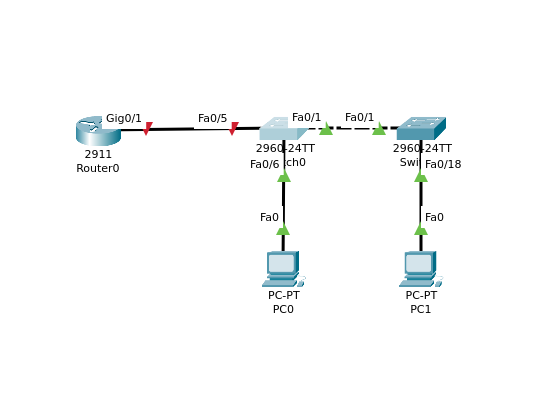
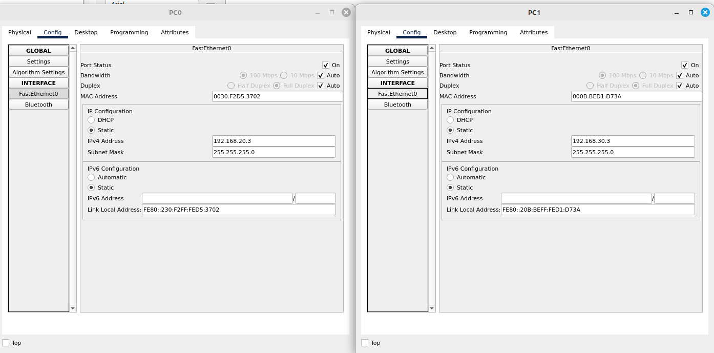

# Топология сети для лабораторной работы 



# Часть 1
### Шаг 1,2,3

Настройка Маршрутизатора
```
Router>enable
Router#conf term
Router(config)#hostname R!
R!(config)#no ip domain-lookup
R!(config)#exit
R!#show run | include domain-lookup
no ip domain-lookup
R!#conf term
R!(config)#enable password class
R!(config)#line console 0
R!(config-line)#password cisco
R!(config-line)#login
R!(config)#line vty 0 15
R!(config-line)#password cisco
R!(config-line)#login
R!(config)#service password-encryption
R!#show running-config
R!(config)#banner motd #Caution#

hostname R!
!
!
!
enable password 7 0822404F1A0A
line con 0
 password 7 0822455D0A16
 login
!
line aux 0
!
line vty 0 4
 password 7 0822455D0A16
 login
line vty 5 15
 password 7 0822455D0A16
 login

R!#copy running-config startup-config
Destination filename [startup-config]? 
Building configuration...
[OK]
R!(config)#ntp server 192.168.1.1
R!(config)#ntp update-calendar
```


Настройка Коммутатора S1
```
Switch>enable
Switch#conf term
Switch(config)#hostname R!
S1(config)#no ip domain-lookup
S1(config)#exit
S1#show run | include domain-lookup
no ip domain-lookup
S1(config)#enable password class
S1(config)#line console 0
S1(config-line)#password cisco
S1(config-line)#login
S1(config)#line vty 0 15
S1(config-line)#password cisco
S1(config-line)#login
S1(config)#banner motd #Caution#
S1(config)#ntp server 192.168.1.1
S1#copy running-config startup-config
Destination filename [startup-config]? 
Building configuration...
[OK]
```
Настройка Коммутатора S2

```
Switch>enable
Switch#conf term
Switch(config)#hostname S2
S2#show run | include domain-lookup 
no ip domain-lookup
S2(config)#enable password class
S2(config)#line console 0
S2(config-line)#password cisco
S2(config-line)#login
S2(config-line)#exit
S2(config)#line vty 0 15
S2(config-line)#password cisco
S2(config-line)#login
S2(config-line)#banner motd #Caution#
S2#copy running-config startup-config
Destination filename [startup-config]? 
Building configuration...
[OK]
```
### Шаг 4

Настройте узлы ПК




# Часть 2. Создание сетей Vlan и назначение портов коммутатора.
### Шаг 1

Создание сети VLAN на коммутаторе S1
```
S1#conf term
S1(config)#vlan 10
S1(config-vlan)#name VLAN10
S1(config-vlan)#exit
S1(config)#interface VLAN10
S1(config-if)#
%LINK-5-CHANGED: Interface Vlan10, changed state to up

S1(config-if)#ip address 192.168.10.11 255.255.255.0
S1(config)#ip default-gateway 192.168.10.1
```
Создание сети VLAN на коммутаторе S2
```
S2(config)#vlan 10
S2(config-vlan)#name VLAN10
S2(config-vlan)#exit
S2(config)#int VLAN10
S2(config-if)#ip address 192.168.10.12 255.255.255.0
S2(config)#int vlan10
S2(config-if)#no shutdown
S2(config)#ip default-gateway 192.168.10.1
```

### Настройка интерфейса управления на маршрутизаторе R1

Добавление портов S1 во VLAN10 на S1
```
S1#configure terminal
Enter configuration commands, one per line.  End with CNTL/Z.
S1(config)#interface range Fa0/6, Fa0/1
S1(config-if-range)#switchport mode access
S1(config-if-range)#switchport access VLAN 10

```
Добавление портов S2 во VLAN10 на S2
```
S2(config)#int range Fa0/1, Fa0/18
S2(config-if-range)#
%CDP-4-NATIVE_VLAN_MISMATCH: Native VLAN mismatch discovered on FastEthernet0/1 (1), with S1 FastEthernet0/1 (10).
switchport mode access
S2(config-if-range)#switchport access vlan 10
S2(config-if-range)#
%LINEPROTO-5-UPDOWN: Line protocol on Interface Vlan10, changed state to up
S2(config-if-range)#exit
```

### Шаг 2
Назначение интерфейсов для VLAN10 на коммутаторе S1 (Интерфейс Fa0/1 транково соединен с интерфейсом Fa 0/1 S2)
```
VLAN Name                             Status    Ports
---- -------------------------------- --------- -------------------------------
1    default                          active    Fa0/2, Fa0/3, Fa0/4, Fa0/7
                                                Fa0/8, Fa0/9, Fa0/10, Fa0/11
                                                Fa0/12, Fa0/13, Fa0/14, Fa0/15
                                                Fa0/16, Fa0/17, Fa0/18, Fa0/19
                                                Fa0/20, Fa0/21, Fa0/22, Fa0/23
                                                Fa0/24, Gig0/1, Gig0/2
10   VLAN10                           active    Fa0/5, Fa0/6
```
Назначение интерфейсов для VLAN10 на коммутаторе S2
```
VLAN Name                             Status    Ports
---- -------------------------------- --------- -------------------------------
1    default                          active    Fa0/2, Fa0/3, Fa0/4, Fa0/5
                                                Fa0/6, Fa0/7, Fa0/8, Fa0/9
                                                Fa0/10, Fa0/11, Fa0/12, Fa0/13
                                                Fa0/14, Fa0/15, Fa0/16, Fa0/17
                                                Fa0/19, Fa0/20, Fa0/21, Fa0/22
                                                Fa0/23, Fa0/24, Gig0/1, Gig0/2
10   VLAN10                           active    Fa0/18
``` 

# Часть 3. Конфигурация магистрального канала стандарта 802.1Q Коммутаторами

### Шаг 1
Настройка статического транкинга на интерфейсах F0/1 для обоих коммутаторов.
S1 - коммутатор
```
S1>show interface trunk
Port        Mode         Encapsulation  Status        Native vlan
Fa0/1       on           802.1q         trunking      10

Port        Vlans allowed on trunk
Fa0/1       10

Port        Vlans allowed and active in management domain
Fa0/1       10

Port        Vlans in spanning tree forwarding state and not pruned
Fa0/1       10
```

S2 - коммутатор
```
S2>show interface trunk
Port        Mode         Encapsulation  Status        Native vlan
Fa0/1       on           802.1q         trunking      10

Port        Vlans allowed on trunk
Fa0/1       10

Port        Vlans allowed and active in management domain
Fa0/1       10

Port        Vlans in spanning tree forwarding state and not pruned
Fa0/1       10
```

Установка native VLAN на коммутаторе S1
```
S1#conf term
Enter configuration commands, one per line.  End with CNTL/Z.
S1(config)#vlan 1000
S1(config-vlan)#name NATIVE_VLAN
S1(config-vlan)#exit
S1(config)#int Fa0/1
S1(config-if)#switchport trunk allowed vlan 10,20,30, 1000
```
Установка native VLAN на коммутаторе S2
```
S2#conf t
Enter configuration commands, one per line.  End with CNTL/Z.
S2(config)#vlan 1000
S2(config-vlan)#Name NATIVE_VLAN
S2(config-vlan)#
S2(config)#int Fa0/1
S2(config-if)#switchport trunk allowed vlan 10, 20, 30, 1000
```
Проверка добавленных VLAN в транк НА S1
```
S1>show interfaces trunk
Port        Mode         Encapsulation  Status        Native vlan
Fa0/1       on           802.1q         trunking      1

Port        Vlans allowed on trunk
Fa0/1       10,20,30

Port        Vlans allowed and active in management domain
Fa0/1       10

Port        Vlans in spanning tree forwarding state and not pruned
Fa0/1       none

```
Проверка добавленных VLAN в транк на S2
```
S2>show int trunk
Port        Mode         Encapsulation  Status        Native vlan
Fa0/1       on           802.1q         trunking      1

Port        Vlans allowed on trunk
Fa0/1       10,20,30

Port        Vlans allowed and active in management domain
Fa0/1       10

Port        Vlans in spanning tree forwarding state and not pruned
Fa0/1       none
```

### Шаг 2

Настройка интерфейса S1 Fa0/5 до R1
```
S1(config)#int Fa0/5
S1(config-if)#switchport mode trunk
S1(config-if)#switchport trunk native vlan 10,20,30
S1#copy startup-config running-config
Destination filename [running-config]? 
S1#show interfaces trunk
Port        Mode         Encapsulation  Status        Native vlan
Fa0/1       on           802.1q         trunking      1
Fa0/5       on           802.1q         trunking      1

Port        Vlans allowed on trunk
Fa0/1       10,20,30
Fa0/5       10,20,30

Port        Vlans allowed and active in management domain
Fa0/1       10
Fa0/5       10

Port        Vlans in spanning tree forwarding state and not pruned
Fa0/1       none
Fa0/5       none
```
# Часть 4. Настройка маршрутизации между сетями VLAN
### Шаг 1. 
```
R1(config-if)#interface gig0/1.10
R1(config-subif)#Default Gateway for VLAN 10
                   ^
% Invalid input detected at '^' marker.
	
R1(config-subif)#Description Default Gateway for VLAN 10
R1(config-subif)#encapsulation dot1Q 10
R1(config-subif)#ip address 192.168.10.1 255.255.255.0
R1(config-subif)#no shutdown
R1(config-subif)#exit
R1(config)#interface gig0/1.20
R1(config-subif)#Description default gateway vlan 20
R1(config-subif)#encapsulation dot1Q 20
R1(config-subif)#ip address 192.168.20.1 255.255.255.0
R1(config-subif)#no shutdown
R1(config-subif)#exit
R1(config)#int gig0/1.30
R1(config-subif)#Description default gateway vlan 30
R1(config-subif)#encapsulation dot1Q 30
R1(config-subif)#ip address 192.168.30.1 255.255.255.0
R1(config-subif)#no shutdown
R1(config-subif)#exit
R1(config)#int gig0.1.1000
                          ^
% Invalid input detected at '^' marker.
	
R1(config)#int gig0/1.1000
R1(config-subif)#Description native vlan 1000
R1(config-subif)#encapsulation dot1Q
% Incomplete command.
R1(config-subif)#encapsulation dot1Q 1000
R1(config-subif)#exit
R1(config)#int Gig0/1
R1(config-if)#exit
R1(config)#int gig0/1
R1(config-if)#Description Trunk link to S1
R1(config-if)#no shutdown
S1#show interfaces trunk
Port        Mode         Encapsulation  Status        Native vlan
Fa0/1       on           802.1q         trunking      1
Fa0/5       on           802.1q         trunking      1

Port        Vlans allowed on trunk
Fa0/1       10,20,30
Fa0/5       10,20,30

Port        Vlans allowed and active in management domain
Fa0/1       10
Fa0/5       10

Port        Vlans in spanning tree forwarding state and not pruned
Fa0/1       none
Fa0/5       none

R1#show ip interface brief
Interface              IP-Address      OK? Method Status                Protocol 
GigabitEthernet0/0     unassigned      YES unset  administratively down down 
GigabitEthernet0/1     unassigned      YES unset  up                    up 
GigabitEthernet0/1.10  192.168.10.1    YES manual up                    up 
GigabitEthernet0/1.20  192.168.20.1    YES manual up                    up 
GigabitEthernet0/1.30  192.168.30.1    YES manual up                    up 
GigabitEthernet0/1.1000unassigned      YES unset  up                    up 
Vlan1                  unassigned      YES unset  administratively down down
```

# Часть 5
### Шаг 1. 
Отправка эхо-запроса на шлюз по-умолчанию с PC-A
```
C:\>ping 192.168.20.1

Pinging 192.168.20.1 with 32 bytes of data:

Reply from 192.168.20.1: bytes=32 time<1ms TTL=255
Reply from 192.168.20.1: bytes=32 time<1ms TTL=255
Reply from 192.168.20.1: bytes=32 time<1ms TTL=255
Reply from 192.168.20.1: bytes=32 time<1ms TTL=255

Ping statistics for 192.168.20.1:
    Packets: Sent = 4, Received = 4, Lost = 0 (0% loss),
Approximate round trip times in milli-seconds:
    Minimum = 0ms, Maximum = 0ms, Average = 0ms
```
Отправка эхо-запроса с PC-A до PC-B
```
C:\>ping 192.168.30.3

Pinging 192.168.30.3 with 32 bytes of data:

Reply from 192.168.30.3: bytes=32 time<1ms TTL=127
Reply from 192.168.30.3: bytes=32 time<1ms TTL=127
Reply from 192.168.30.3: bytes=32 time<1ms TTL=127
Reply from 192.168.30.3: bytes=32 time<1ms TTL=127

Ping statistics for 192.168.30.3:
    Packets: Sent = 4, Received = 4, Lost = 0 (0% loss),
Approximate round trip times in milli-seconds:
    Minimum = 0ms, Maximum = 0ms, Average = 0ms
```

Отправка эхо запроса с PC-A на коммутатор S2
```
C:\>ping 192.168.10.12

Pinging 192.168.10.12 with 32 bytes of data:

Request timed out.
Request timed out.
Reply from 192.168.10.12: bytes=32 time<1ms TTL=254
Reply from 192.168.10.12: bytes=32 time<1ms TTL=254

Ping statistics for 192.168.10.12:
    Packets: Sent = 4, Received = 2, Lost = 2 (50% loss),
Approximate round trip times in milli-seconds:
    Minimum = 0ms, Maximum = 0ms, Average = 0ms

```

### Шаг 2
Tracert от PC-B к PC-A

```
C:\>tracert 192.168.20.3

Tracing route to 192.168.20.3 over a maximum of 30 hops: 

  1   0 ms      0 ms      0 ms      192.168.30.1
  2   0 ms      0 ms      0 ms      192.168.20.3
```


P.S  Потратил много времени на попытки отправить эхо-запросы , оказалось не создал vlan 20 и 30 на коммутаторах. Спустя большое количество попыток траблшутинга пришел к тому, что банально не добавил вланы на коммутаторы =\