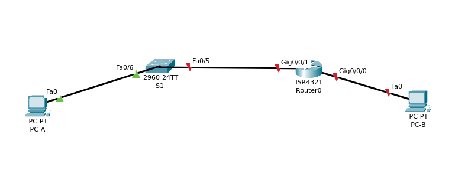
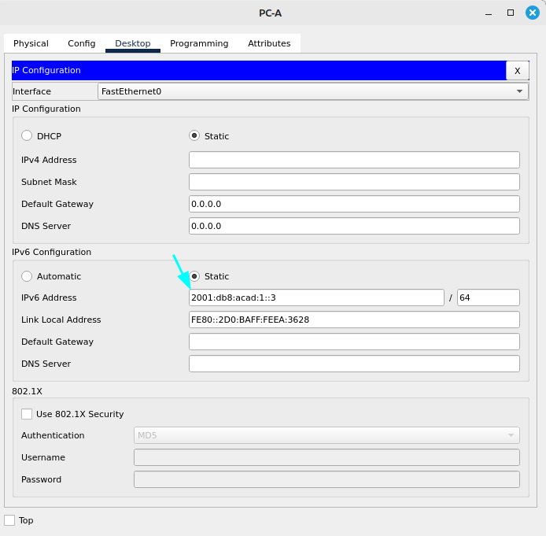
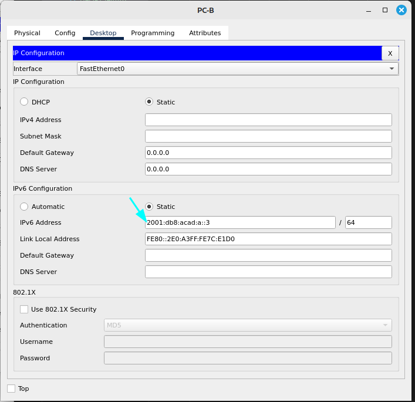
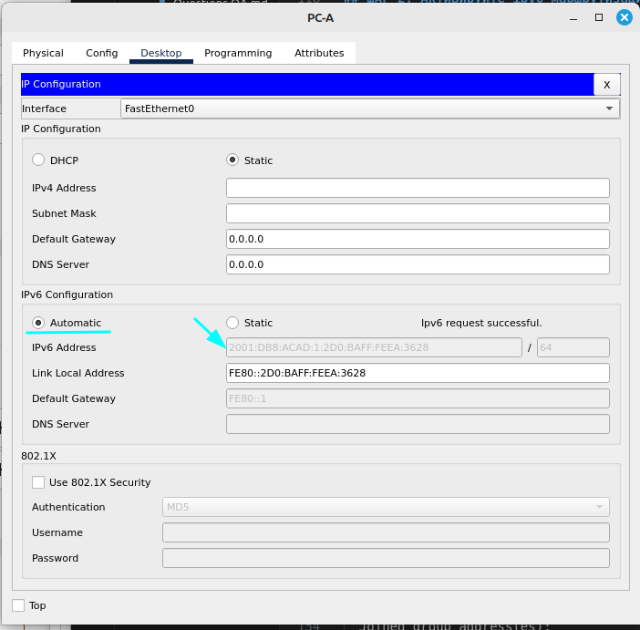
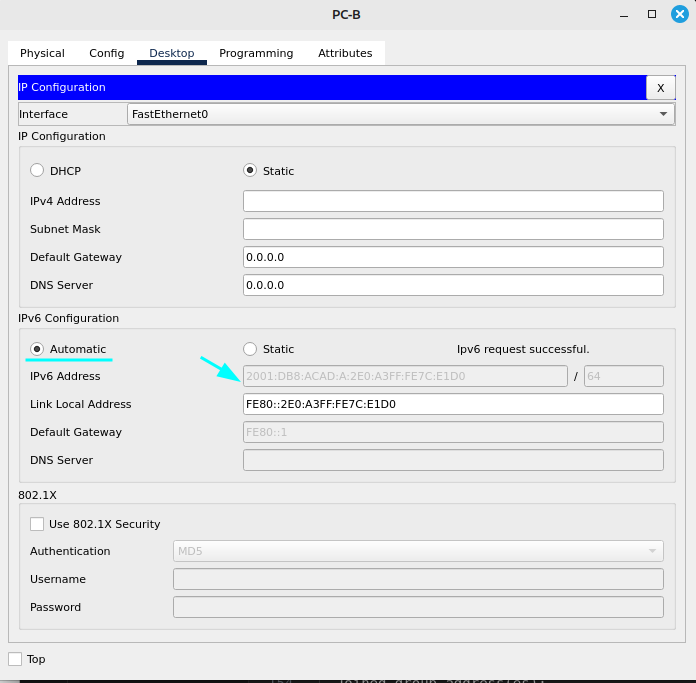

# Часть 1 
## Топология лабораторной работы 

### Предварительные настройки устройств.
```
S1# configure terminal
S1(config)# sdm prefer dual-ipv4-and-ipv6 default
S1(config)# end
S1# reload
Loading "flash:/2960-lanbasek9-mz.150-2.SE4.bin"...
########################################################################## [OK]
```

### Шаг 1. Настройте маршрутизатор
- Назначьте имя хоста и настройте основные параметры устройства.
```
Router0#(config)hostname R1
R1(config)enable secret cisco
R1(config)#line console 0
R1(config-line)#password cisco
R1(config-line)#login
R1(config-line)#
R1(config-line)#exit
R1(config)#line vty 5 15
R1(config-line)#password cisco
R1(config-line)#login
R1(config-line)#transport input ssh 
R1(config-line)#password encryption 
R1(config-line)#banner motd #WARNING#
R1(config)#end
```

### Шаг 2. Настройте коммутатор
- Назначьте имя хоста и настройте основные параметры устройства.
```
Switch0#(config)hostname S1
S1(config)#
S1(config)#enable password cisco
S1(config)#
S1(config)#line console 0
S1(config-line)#password cisco
S1(config-line)#login
S1(config-line)#exit
S1(config)#line vty 5 15
S1(config-line)#password cisco
S1(config-line)#login
S1(config-line)#transport input ssh
S1(config-line)#password encryption
S1(config-line)#banner motd #WARNING# 
S1(config)#end

```

# Часть 2. Ручная настройка IPV6 адресов
## ШАГ 1. Назначьте IPv6-адреса интерфейсам Ethernet на R1.

Изначально на R1 гигабитные интерфейсы отключены. Команды для включения:
```
R1(config)#interface GigabitEthernet0/0/0
R1(config-if)#no shutdown
R1(config)#interface GigabitEthernet0/0/1
R1(config-if)#no shutdown
```
Настройка глобальных-индивидуальных ipv6-адресов
```
R1(config)#interface gig0/0/1
R1(config-if)#
R1(config-if)#
R1(config-if)#ipv6 address 2001:db8:acad:1::1 
% Incomplete command.
R1(config-if)#ipv6 address 2001:db8:acad:1::1/64 
R1(config-if)#
R1(config-if)#exit
R1(config)#interface gig0/0/0
R1(config-if)#ipv6 address 2001:db8:acad:a::1
% Incomplete command.
R1(config-if)#ipv6 address 2001:db8:acad:a::1/64
R1(config-if)#
R1(config-if)#
R1(config-if)#exit
```
Получение информации об адресах ipv6
```
R1#show ipv6 interface brief
GigabitEthernet0/0/0       [up/up]
    FE80::210:11FF:FE9C:3201
    2001:DB8:ACAD:A::1
GigabitEthernet0/0/1       [up/up]
    FE80::210:11FF:FE9C:3202
    2001:DB8:ACAD:1::1
```
Настройка локальных ipv6 адресов
```
R1(config)#interface gig0/0/0
R1(config-if)#ipv6 address fe80::1 link-local
R1(config-if)#exit
R1(config)#interface gig0/0/1
R1(config-if)#ipv6 address fe80::1 link-local
R1(config-if)#exit
```
Получение информации о локальных ipv6 адресах
```
R1#show ipv6 interface brief
GigabitEthernet0/0/0       [up/up]
    FE80::1
    2001:DB8:ACAD:A::1
GigabitEthernet0/0/1       [up/up]
    FE80::1
    2001:DB8:ACAD:1::1
Vlan1                      [administratively down/down]
    unassigned
```

#### Какие группы многоадресной рассылки назначены интерфейсу G0/0?

Ответ: ff02::1 - группа для всех узлов в локальной сети и ff02::2 - группаа для всех маршрутизаторов в локальной сети. 

## ШАГ 2. Активируйте ipv6-маршрутизацию на R1

```
C:\>ipconfig

FastEthernet0 Connection:(default port)

   Connection-specific DNS Suffix..: 
   Link-local IPv6 Address.........: FE80::2E0:A3FF:FE7C:E1D0
   IPv6 Address....................: ::
   IPv4 Address....................: 0.0.0.0
   Subnet Mask.....................: 0.0.0.0
   Default Gateway.................: ::
                                     0.0.0.0
```

- Почему PC-B получил глобальный префикс маршрутизации и идентификатор подсети, которые вы настроили на R1?

Ответ: PC-B получил глобальный префикс маршрутизации и идентификатор подсети на основе полученной информации от R1 когда произошел обмен RA-сообщением. Также компьютер поддерживает SLAAC


## ШАГ 3. Назначьте IPv6-адреса интерфейсу управления (SVI) на S1.
```
S1(config)#interface vlan1
S1(config-if)#ipv6 address 2001:db8:acad:1::b/64
S1(config-if)#ipv6 address fe80::b link-local
S1(config-if)#
```
Проверка назначенных адресов
```
S1#show ipv6 interface 
Vlan1 is up, line protocol is up
  IPv6 is enabled, link-local address is FE80::B
  No Virtual link-local address(es):
  Global unicast address(es):
    2001:DB8:ACAD:1::B, subnet is 2001:DB8:ACAD:1::/64
  Joined group address(es):
    FF02::1
    FF02::1:FF00:B
```
## ШАГ 4. Назначьте компьютерам статические IPv6-адреса.






# Часть 3. Проверка сквозного подключения
 
- Эхо запрос на R1 от PC-A
```
C:\>ping fe80::1

Pinging fe80::1 with 32 bytes of data:

Reply from FE80::1: bytes=32 time<1ms TTL=255
Reply from FE80::1: bytes=32 time<1ms TTL=255
Reply from FE80::1: bytes=32 time<1ms TTL=255
Reply from FE80::1: bytes=32 time<1ms TTL=255

Ping statistics for FE80::1:
    Packets: Sent = 4, Received = 4, Lost = 0 (0% loss),
Approximate round trip times in milli-seconds:
    Minimum = 0ms, Maximum = 0ms, Average = 0ms
```
- Эхо запрос на S1 от PC-A
```
C:\>ping fe80::b

Pinging fe80::b with 32 bytes of data:

Reply from FE80::B: bytes=32 time=2004ms TTL=255
Reply from FE80::B: bytes=32 time<1ms TTL=255
Reply from FE80::B: bytes=32 time<1ms TTL=255
Reply from FE80::B: bytes=32 time<1ms TTL=255

Ping statistics for FE80::B:
    Packets: Sent = 4, Received = 4, Lost = 0 (0% loss),
Approximate round trip times in milli-seconds:
    Minimum = 0ms, Maximum = 2004ms, Average = 501ms
```

- Tracert от PC-A до PC-B 
```

C:\>tracert 2001:DB8:ACAD:A::3

Tracing route to 2001:DB8:ACAD:A::3 over a maximum of 30 hops: 

  1   0 ms      0 ms      0 ms      2001:DB8:ACAD:1::1
  2   0 ms      0 ms      0 ms      2001:DB8:ACAD:A::3
```
- С PC-B отправьте эхо-запрос на PC-A.
```
C:\>ping 2001:DB8:ACAD:1::3

Pinging 2001:DB8:ACAD:1::3 with 32 bytes of data:

Reply from 2001:DB8:ACAD:1::3: bytes=32 time<1ms TTL=127
Reply from 2001:DB8:ACAD:1::3: bytes=32 time<1ms TTL=127
Reply from 2001:DB8:ACAD:1::3: bytes=32 time<1ms TTL=127
Reply from 2001:DB8:ACAD:1::3: bytes=32 time<1ms TTL=127

Ping statistics for 2001:DB8:ACAD:1::3:
    Packets: Sent = 4, Received = 4, Lost = 0 (0% loss),
Approximate round trip times in milli-seconds:
    Minimum = 0ms, Maximum = 0ms, Average = 0ms
```

-С PC-B отправьте эхо-запрос на локальный адрес канала G0/0/0 на R1.
```
ping fe80::1

Pinging fe80::1 with 32 bytes of data:

Reply from FE80::1: bytes=32 time<1ms TTL=255
Reply from FE80::1: bytes=32 time<1ms TTL=255
Reply from FE80::1: bytes=32 time<1ms TTL=255
Reply from FE80::1: bytes=32 time<1ms TTL=255

Ping statistics for FE80::1:
    Packets: Sent = 4, Received = 4, Lost = 0 (0% loss),
Approximate round trip times in milli-seconds:
    Minimum = 0ms, Maximum = 0ms, Average = 0ms
```